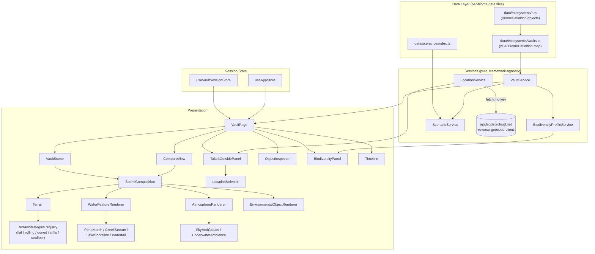
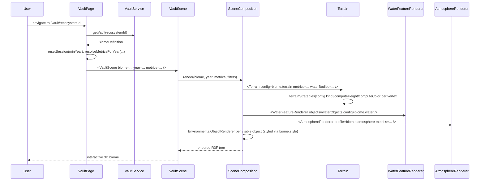
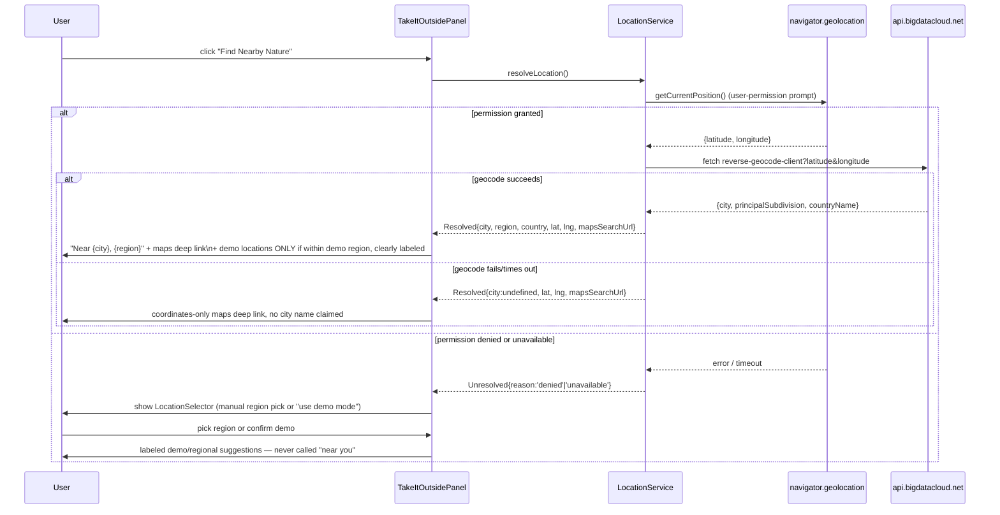

# Design Document: Biome Architecture Expansion

## Overview

NatureVault currently has four ecosystems that all render through the same generic pipeline: one `Terrain` (rolling-hills PlaneGeometry with vertex-color height noise), one `Water` (irregular blob shader), and a shared roster of primitives (`Tree`, `Rock`, `Mountain`, `MeadowPatch`, `ReedCluster`, `Bird`, `Animal`, `Frog`, `Fungi`, `Pollinator`, `Building`, `PathRibbon`) repositioned per ecosystem. Switching ecosystems today changes labels, colors, and object placement, but not the underlying "shape" of the world — a desert would look like a green hill with different rocks.

This design introduces a **Biome** data model that lets each ecosystem declare, as data, *how* its world should be built: which terrain strategy generates its ground, which water feature (if any) it has, what its sky/lighting/fog should feel like, and what its wildlife/vegetation roster and biodiversity hierarchy look like. Rendering code becomes a set of small strategy implementations dispatched by biome data, so an 8th (or 9th, or 12th) biome is a new data file, not a rendering change.

The design also fixes the two concrete bugs called out in scope: `CompareView`'s `MiniScene` duplicating `VaultScene`'s render setup (via a new shared `SceneComposition`), and `TakeItOutsidePanel`/`LocationService` presenting hardcoded Portland-area locations as "near you" regardless of where the user actually is.

Everything here builds on the existing architecture (`VaultDefinition`, `EnvironmentalObject`, `VaultService`, `ScenarioService`, `useVaultSessionStore`, `EnvironmentalObjectRenderer`'s kind-dispatch pattern) rather than replacing it. Where a rename is proposed (e.g. `VaultDefinition` → `BiomeDefinition`), a compatibility alias is specified so the migration can land incrementally.

## Architecture



**Key architectural decisions:**

1. **Single generic mesh-builders, swappable strategies.** `Terrain` stays one component (one `PlaneGeometry`, one vertex-coloring loop) but its per-vertex height/color functions are pulled from a `terrainStrategies` registry keyed by `TerrainConfig.kind`. This avoids five near-duplicate terrain components while still letting a desert's dunes and a seafloor's flatness compute height completely differently.
2. **Water is *not* one component with props for everything.** The existing `Water.tsx` (irregular blob + custom shader) becomes one variant (`PondMarsh`) among several (`CreekStream`, `LakeShoreline`, `Waterfall`), all built on a shared extracted shader hook so the GLSL isn't duplicated four times. "No water" (desert) and "underwater ambience" (reef) are handled outside this renderer entirely (desert has no water object; reef's water *is* the atmosphere, not a discrete object).
3. **Atmosphere is biome data, not a hardcoded lighting rig.** `VaultScene`'s directional/ambient/hemisphere lights and fog color are currently literal values. They move into `BiomeDefinition.atmosphere` so a desert's harsh white sun and a reef's cool underwater tint are just different data, dispatched through one `SceneComposition`.
4. **`SceneComposition` is the single render tree** consumed by both the interactive `VaultScene` (full `Canvas` + `OrbitControls`) and `CompareView`'s `MiniScene` (smaller `Canvas` + its own `OrbitControls`), eliminating the current duplication.
5. **Vegetation/wildlife "palette" is mostly a styling concern, not a generator.** Object instances are still hand-authored in `biome.objects[]` (as today) — that keeps content review simple and avoids a procedural-placement engine we don't have time to validate. What *is* data-driven is *how those instances are colored/shaped* (`BiomeStyle`) and *which primitive* a given `ObjectKind`+variant renders as. New primitives are only introduced when shape/behavior is genuinely different (e.g. `Coral`, `Cactus`, `FishSchool`), not for simple recoloring (recoloring goes through `BiomeStyle` props on existing primitives).
6. **Biodiversity hierarchy and species-count summaries are derived, not hand-authored**, computed from `biome.objects[]` at render/load time by `BiodiversityProfileService`, so they can never drift out of sync with the actual object list.

## Sequence Diagrams

### Entering a Vault and rendering a biome-specific scene



### "Take It Outside" location resolution (bug fix flow)



## Components and Interfaces

### 1. `src/types/biome.ts` (NEW)

Holds the biome-specific configuration types that `BiomeDefinition` (in `vault.ts`) composes.

```typescript
export type TerrainKind = 'flat-grassland' | 'rolling-hills' | 'duned-desert' | 'elevated-cliffs' | 'seafloor';

export interface TerrainPalette {
  primary: string;      // e.g. lush grass / sand / stone
  secondary: string;     // e.g. dry grass / rock crevice
  shoreline?: string;    // mud/sand near water — omitted if water.kind === 'none'
  developed: string;     // tint blended in as developmentLevel rises
}

export interface TerrainConfig {
  kind: TerrainKind;
  palette: TerrainPalette;
  /** Strategy-specific tuning, validated per-kind by the matching strategy impl. */
  params?: {
    duneAmplitude?: number;      // duned-desert
    cliffFaces?: number;         // elevated-cliffs: count of angular cliff faces
    elevationScale?: number;     // elevated-cliffs / rolling-hills
    seafloorDepth?: number;      // seafloor: how far below the "surface" the floor sits
  };
}

export type WaterKind = 'none' | 'creek-stream' | 'pond-marsh' | 'lake-shoreline' | 'waterfall' | 'underwater-ambient';

export interface WaterConfig {
  kind: WaterKind;
  /** Base tint used by whichever water primitives this biome instantiates. */
  deepColor?: string;
  shallowColor?: string;
}

export type SkyTreatment = 'sky-and-clouds' | 'underwater-ambience';

export interface AtmosphereProfile {
  skyTreatment: SkyTreatment;
  sun: { color: string; intensity: number; position: [number, number, number] };
  ambient: { color: string; intensity: number };
  hemisphere: { skyColor: string; groundColor: string; intensity: number };
  fog: { color: string; near: number; far: number };
}

export interface CameraDefaults {
  position: [number, number, number];
  target: [number, number, number];
  fov?: number;
  minDistance?: number;
  maxDistance?: number;
  maxPolarAngle?: number;
}

/** Per-ObjectKind (+ optional variant) visual overrides, so recoloring doesn't require new primitives. */
export interface BiomeStyleEntry {
  kind: import('./vault').ObjectKind;
  variant?: string;
  colorPrimary?: string;
  colorAccent?: string;
  densityMultiplier?: number; // scales instanced counts, e.g. grass/reed/coral density
}

export interface BiomeStyle {
  entries: BiomeStyleEntry[];
}

export type TrophicRole = 'producer' | 'primary-consumer' | 'secondary-consumer' | 'decomposer';

export interface BiodiversityProfile {
  totalSpecies: number;
  byCategory: Record<import('./observation').BiodiversityCategory, number>;
  byTrophicRole: Record<TrophicRole, number>;
  /** Always shown alongside the profile — this is illustrative content, not a scientific survey. */
  disclaimer: string;
}
```

### 2. `src/types/vault.ts` (EXTENDED)

`VaultDefinition` gains the biome config fields and is renamed `BiomeDefinition`; `VaultDefinition` remains as a type alias so existing imports (`VaultService`, `ScenarioService`, `CompareView`, etc.) keep compiling during migration.

```typescript
import type { TerrainConfig, WaterConfig, AtmosphereProfile, CameraDefaults, BiomeStyle, TrophicRole } from './biome';

export type ObjectKind =
  | 'tree' | 'plant' | 'reed' | 'animal' | 'frog' | 'bird' | 'pollinator' | 'fungi'
  | 'river' | 'pond' | 'creek' | 'lake' | 'waterfall'      // water kinds (creek/lake/waterfall are NEW)
  | 'mountain' | 'rock' | 'building' | 'road' | 'path'
  | 'fern' | 'moss' | 'log'                                 // NEW: temperate forest
  | 'cactus' | 'dryRiverbed'                                // NEW: desert
  | 'vine' | 'tropicalFlower' | 'canopyTree'                // NEW: tropical forest
  | 'coral' | 'fishSchool'                                  // NEW: coral reef
  | 'termiteMound';                                         // NEW: savanna

export interface EnvironmentalObject {
  id: string;
  kind: ObjectKind;
  variant?: string;                    // e.g. tree variant: 'conifer' | 'broadleaf' | 'palm'
  biodiversityCategory: BiodiversityCategory | null;
  name: string;
  position: [number, number, number];
  presentInYears: number[];
  description: string;
  ecologicalRole: string;
  historicalChange: string;
  relatedSpecies?: string[];
  connection?: EcosystemConnection;

  // --- NEW optional fields (additive, non-breaking) ---
  trophicRole?: TrophicRole;
  habitat?: string;
  diet?: string;
  environmentalPressures?: string[];
  /** Radius/size hint used by Terrain's shoreline carving and by WaterFeatureRenderer; replaces
   *  the previous hardcoded per-kind radius constants duplicated in VaultScene/CompareView. */
  featureRadius?: number;
}

export interface BiomeDefinition {
  ecosystemId: string;
  name: string;
  location: string;
  years: VaultYearState[];        // unchanged shape; length is now variable (see Timeline section)
  objects: EnvironmentalObject[];
  storyChapters: StoryChapter[];

  // --- NEW biome config ---
  terrain: TerrainConfig;
  water: WaterConfig;
  atmosphere: AtmosphereProfile;
  cameraDefaults: CameraDefaults;
  style: BiomeStyle;
}

/** @deprecated use BiomeDefinition — kept so existing imports keep compiling during migration. */
export type VaultDefinition = BiomeDefinition;
```

### 3. Terrain strategy registry — `src/components/Ecosystem/terrainStrategies/`

Each strategy is a pure pair of functions; `Terrain.tsx` keeps its existing `PlaneGeometry` vertex loop but delegates height/color to `terrainStrategies[config.kind]`.

```typescript
// src/components/Ecosystem/terrainStrategies/types.ts
export interface TerrainVertexContext {
  x: number; z: number; index: number;
  waterInfluence: number;   // 0-1, distance-based proximity to nearest water body (from Terrain's existing basin-carving logic)
  developmentLevel: number; // 0-1
}

export interface TerrainStrategy {
  computeHeight(ctx: TerrainVertexContext, params: TerrainConfig['params']): number;
  computeColor(ctx: TerrainVertexContext, height: number, palette: TerrainPalette, params: TerrainConfig['params']): THREE.Color;
}
```

- `rollingHills.ts` — extracted verbatim from the current `Terrain.tsx` noise/coloring logic (default for temperate forest, wetland-adjacent land, alpine meadow floor).
- `flatGrassland.ts` — near-zero height variance, wide grass/dry-grass blend (savanna, freshwater lake shoreline).
- `dunedDesert.ts` — larger-amplitude, lower-frequency sine/cos layering to read as dunes, `sand`/`sandDry` palette blend, no `shoreline` palette entry used (desert has `water.kind === 'none'`).
- `elevatedCliffs.ts` — adds a base elevation offset plus sharper, higher-amplitude ridges and a rock-face color band above a height threshold (alpine's real elevation, replacing the current flat-terrain-plus-background-mountain-prop approach).
- `seafloor.ts` — height sits below the water plane, gentle undulation only, sandy/rocky palette with a blue-green tint multiplied in (reef).

`Terrain.tsx`'s public props change from `{ developmentLevel, waterLevel, waterBodies }` to `{ config: TerrainConfig, developmentLevel, waterLevel, waterBodies }`; internal vertex loop calls `terrainStrategies[config.kind].computeHeight(...)`/`computeColor(...)` where it currently inlines the rolling-hills math. `waterBodies` continues to drive the shoreline-carving `waterInfluence` term (generalized to read `featureRadius` off each object instead of the hardcoded `kind === 'river' ? 9 : 4.5` currently duplicated in `VaultScene.tsx` and `CompareView.tsx`).

### 4. Water variants — `src/components/Ecosystem/water/`

- `useWaterShaderMaterial.ts` (NEW) — extracts the vertex/fragment shader strings and uniform setup currently inline in `Water.tsx` into a shared hook `useWaterShaderMaterial({ deepColor, shallowColor, selected, dimmed })` returning `{ materialRef, uniforms, vertexShader, fragmentShader }`, so every water variant uses one shader implementation instead of copy-pasting GLSL.
- `PondMarsh.tsx` — the current `Water.tsx` component, renamed, using the shared hook. Handles `kind: 'pond' | 'river'` (kept as-is; "river" continues to mean a slow wide channel through wetland/forest).
- `CreekStream.tsx` (NEW) — narrow elongated shape (built from a thin rectangle-ish `Shape` rather than the radial blob) with a directional UV-scroll on the shader's `shimmer` term to read as flowing water; handles `kind: 'creek'`.
- `LakeShoreline.tsx` (NEW) — same shader/material, larger radius, lower `irregularity` default, paired with `Terrain`'s shoreline carving over a wider `featureRadius` so the basin reads as a real lake rather than a puddle; handles `kind: 'lake'`.
- `Waterfall.tsx` (NEW) — a near-vertical plane with a fast one-directional UV scroll (reusing the shared shader with a `flowAxis: 'vertical'` uniform) plus a small instanced foam/splash burst at its base (reusing the `MeadowPatch`-style instancing pattern with a white/foam material); handles `kind: 'waterfall'`.
- `WaterFeatureRenderer.tsx` (NEW, thin dispatcher) — given the list of visible water-kind objects, renders the matching variant per object's `kind`. Called from `SceneComposition`, replacing the `river`/`pond` cases that currently live inline in `EnvironmentalObjectRenderer`'s switch (those cases move here so `EnvironmentalObjectRenderer` stays focused on non-water scenery/wildlife/vegetation).

Reef's "underwater-ambient" is deliberately **not** a water-kind object — a reef biome has no surface to render; the entire scene is submerged. That is expressed via `biome.water.kind === 'underwater-ambient'` and handled by the atmosphere layer (below), not by `WaterFeatureRenderer`.

### 5. Atmosphere — `src/components/Ecosystem/atmosphere/`

- `AtmosphereRenderer.tsx` (NEW) — dispatches on `profile.skyTreatment`:
  - `'sky-and-clouds'` → existing `SkyAndClouds` (moved under `atmosphere/`), now taking `sun`/`fog` color from `profile` instead of the hardcoded `turbidity`/colors baked into the component today.
  - `'underwater-ambience'` → `UnderwaterAmbience.tsx` (NEW) — no `Sky` dome; renders a full-scene blue-green tint via the R3F fog + a handful of animated translucent planes as light shafts (reusing the drifting-motion pattern already used for clouds in `SkyAndClouds`) plus slow-rising instanced bubble particles.
- Declarative fog: `SceneComposition` renders `<fog attach="fog" args={[profile.fog.color, profile.fog.near, profile.fog.far]} />` sourced from `biome.atmosphere.fog`, replacing the imperative `scene.fog = new THREE.Fog(...)` currently set in `VaultScene`'s `Canvas onCreated`. This is what makes fog shareable between `VaultScene` and `CompareView` without duplicating an `onCreated` callback in both places.
- Lighting: `SceneComposition` renders `<directionalLight color={atmosphere.sun.color} intensity={atmosphere.sun.intensity} position={atmosphere.sun.position} />`, `<ambientLight .../>`, `<hemisphereLight args={[...]} .../>` from `biome.atmosphere` instead of the literal values currently hardcoded in both `VaultScene.tsx` and `CompareView.tsx`'s `MiniScene`.

### 6. `SceneComposition.tsx` (NEW) — `src/components/Ecosystem/SceneComposition.tsx`

```typescript
interface SceneCompositionProps {
  biome: BiomeDefinition;
  year: number;
  metrics: VaultStateMetrics;
  selectedObjectId?: string | null;
  hoveredObjectId?: string | null;
  biodiversityFilter?: BiodiversityCategory | null;
  interactive: boolean;              // false for CompareView's MiniScene (no selection/hover wiring needed, still clickable-safe)
  onSelect?: (id: string) => void;
  onHover?: (id: string | null) => void;
}

export function SceneComposition(props: SceneCompositionProps): JSX.Element;
```

Contains exactly what `VaultScene`'s current `SceneContents` contains (lights, fog, `AtmosphereRenderer`, `Terrain`, water bodies via `WaterFeatureRenderer`, `EnvironmentalObjectRenderer` per visible object with dimming logic) — that function is relocated here almost unchanged, parameterized by `biome` instead of `vault`. `VaultScene` and `CompareView`'s `MiniScene` both become thin wrappers: a `Canvas` with biome-appropriate `camera` (from `biome.cameraDefaults`) and `OrbitControls`, containing `<SceneComposition .../>`.

### 7. `EnvironmentalObjectRenderer.tsx` (EXTENDED)

Adds switch cases for the new `ObjectKind`s, each resolving its color/variant through `biome.style` before delegating to a primitive:

```typescript
function resolveStyle(style: BiomeStyle, kind: ObjectKind, variant?: string): BiomeStyleEntry | undefined {
  return style.entries.find((e) => e.kind === kind && (variant ? e.variant === variant : true))
      ?? style.entries.find((e) => e.kind === kind && !e.variant);
}
```

New primitive components (small, single-purpose, following the existing file-per-primitive pattern):
- `Fern.tsx`, `MossPatch.tsx`, `FallenLog.tsx` — temperate forest.
- `Cactus.tsx`, `DryRiverbed.tsx` (a dry, cracked-earth `PathRibbon`-like ribbon with no water) — desert.
- `Vine.tsx` (draped instanced curve segments on a host tree), `TropicalFlower.tsx` (variant of `Pollinator`'s flower-adjacent styling, brighter palette) — tropical forest. `canopyTree` reuses `Tree` with `variant="broadleaf"` (wider, flatter foliage geometry) rather than a new component.
- `Coral.tsx` (branching instanced clusters, color driven by `biome.style`), `FishSchool.tsx` (instanced mesh of small fish following a shared boid-lite drift, modeled after `Bird`'s circling pattern but horizontal and grouped) — coral reef.
- `TermiteMound.tsx` (a simple tapered cone cluster akin to `Rock`'s build pattern) — savanna; savanna's watering hole reuses `PondMarsh` with a small `featureRadius`.

`Tree.tsx` and `Rock.tsx` gain an optional `colorOverride`/`variant` prop (currently they hardcode `foliageColor`/`#7a7568`); `EnvironmentalObjectRenderer` passes `resolveStyle(...)?.colorPrimary` through. This is the "recoloring via data, not new components" half of the reusable-vs-bespoke decision.

### 8. `BiodiversityProfileService.ts` (NEW) — `src/services/BiodiversityProfileService.ts`

```typescript
import type { BiomeDefinition } from '../types/vault';
import type { BiodiversityProfile } from '../types/biome';

export const EDUCATIONAL_DATA_DISCLAIMER =
  'Illustrative educational simulation data, not a scientific species inventory.';

export const BiodiversityProfileService = {
  /** Derives species counts from the biome's own object list for a given year (or all years if omitted). */
  computeProfile(biome: BiomeDefinition, year?: number): BiodiversityProfile;
};
```

Consumed by `BiodiversityPanel` to render a `BiodiversitySummaryCard` ("24 species represented — 10 Plants, 6 Birds, 4 Pollinators...") above the existing category filter grid, always paired with `EDUCATIONAL_DATA_DISCLAIMER`.

### 9. `ObjectInspector.tsx` (EXTENDED layout)

New section order (existing sections kept, new ones inserted; all conditionally rendered when the field is present so scenery objects like `Rock`/`Mountain` are unaffected):

1. Header: name, kind label, biodiversity category emoji+label (unchanged).
2. **Trophic role badge** (NEW) — small pill, e.g. "Producer" / "Primary Consumer", shown when `object.trophicRole` is set.
3. "What you're seeing" — `description` (unchanged).
4. "Why it matters" — `ecologicalRole` (unchanged).
5. **Habitat** (NEW, conditional) — `object.habitat`.
6. **Diet** (NEW, conditional) — `object.diet`.
7. "What changed" — `historicalChange` (unchanged).
8. **Environmental pressures** (NEW, conditional) — bullet list from `object.environmentalPressures`.
9. Related species (unchanged, existing `relatedSpecies` chips).
10. Ecosystem connections (unchanged, existing `connection.chain`, gated by `showConnections`).
11. Viewing year footer (unchanged).

`kindLabel` map in `ObjectInspector.tsx` gains entries for all new `ObjectKind`s (`creek: 'Creek'`, `lake: 'Lake'`, `waterfall: 'Waterfall'`, `fern: 'Fern'`, `moss: 'Moss'`, `log: 'Fallen Log'`, `cactus: 'Cactus'`, `dryRiverbed: 'Dry Riverbed'`, `vine: 'Vine'`, `tropicalFlower: 'Tropical Flower'`, `canopyTree: 'Canopy Tree'`, `coral: 'Coral'`, `fishSchool: 'Fish School'`, `termiteMound: 'Termite Mound'`).

### 10. `LocationService.ts` (REWRITTEN) — `src/services/LocationService.ts`

```typescript
export interface ResolvedLocation {
  status: 'resolved';
  latitude: number;
  longitude: number;
  city?: string;
  region?: string;
  country?: string;
  /** Deep link to a maps search scoped to the real resolved coordinates — no key, no fabricated POIs. */
  mapsSearchUrl: string;
  /** True only when the resolved location is within the curated demo dataset's region (Portland area). */
  isWithinDemoRegion: boolean;
}

export interface UnresolvedLocation {
  status: 'denied' | 'unavailable' | 'geocode-failed';
  /** Present when geocoding failed but coordinates were obtained — still useful for a maps link. */
  latitude?: number;
  longitude?: number;
  mapsSearchUrl?: string;
}

export type LocationResult = ResolvedLocation | UnresolvedLocation;

export const LocationService = {
  /** Never called automatically — only in response to a user-initiated "Find Nearby Nature" click. */
  async resolveLocation(): Promise<LocationResult>;

  buildMapsSearchUrl(latitude: number, longitude: number, query?: string): string;

  /** Only for the explicit manual-selector fallback — clearly a curated demo list, never labeled "near you". */
  getFallbackLocations(ecosystemType: string): DemoLocation[];
  getManualRegionOptions(): ManualRegionOption[];
};
```

Behavior:
1. `requestLocation()` (existing geolocation wrapper) is kept as-is internally.
2. On success, calls `fetch('https://api.bigdatacloud.net/data/reverse-geocode-client?latitude={lat}&longitude={lng}&localityLanguage=en')` — a keyless, CORS-enabled, client-side-only endpoint (per BigDataCloud's fair-use policy: real-time coordinates from the calling device only, never cached/replayed server-side, which matches this app's no-backend architecture exactly). A plain `fetch` call is used rather than adding the `@bigdatacloudapi` npm client package, since only one endpoint/shape is needed — this avoids a new runtime dependency for a single GET request.
3. Builds `mapsSearchUrl` via `buildMapsSearchUrl` — a plain URL (`https://www.google.com/maps/search/?api=1&query=parks+near+{lat},{lng}` or OpenStreetMap equivalent), which needs no API key and gives genuinely location-specific results instead of fabricated POI data for an arbitrary global city.
4. `isWithinDemoRegion` is a simple bounding-box check around the Portland/Oregon coast area already covered by `demoLocations.ts`. `TakeItOutsidePanel` only shows the curated `demoLocations` list when this is `true`, and even then labels it "Example Portland-area locations" rather than implying live proximity.
5. On geolocation denial/timeout/unavailability, or geocode fetch failure, returns an `UnresolvedLocation` — the panel then shows `LocationSelector` (manual fallback) instead of silently substituting Portland data. This is the actual bug fix: **no path in the new design can produce a "near you" label for an unrelated hardcoded city.**

### 11. `LocationSelector.tsx` (NEW) — `src/components/Vault/LocationSelector.tsx`

Shown when `LocationService.resolveLocation()` returns `UnresolvedLocation`. Offers:
- A short list of `ManualRegionOption` buttons (a handful of broad, clearly-fictional-for-demo-purposes regions, e.g. "Pacific Northwest (demo)", "Explore near a city you type") each either linking to the curated demo set or accepting free-text city input purely to build a `mapsSearchUrl` (`https://www.google.com/maps/search/?api=1&query=parks+near+{encoded city}`) — no geocoding needed for this path since Maps' own search box resolves the free-text query.
- A "Try location access again" button that re-invokes `resolveLocation()`.
- Explicit copy: "We couldn't detect your location. Choose a region or search manually — we won't guess." This directly satisfies "never present unrelated locations as near you without disclosure."

### 12. `TakeItOutsidePanel.tsx` (REWRITTEN)

State machine: `'idle' | 'resolving' | 'resolved' | 'unresolved'`. Replaces the current `checking`/`locations` boolean-ish state. `'resolved'` renders the resolved city/region (if present), the `mapsSearchUrl` as a real link/button ("Search nearby parks & trails"), and — only when `isWithinDemoRegion` — the existing curated `demoLocations` list under an explicit "Example Portland-area locations" heading. `'unresolved'` renders `LocationSelector`.

### 13. Timeline / ScenarioService — reviewed, minimal changes

- **`Timeline.tsx`**: already generic over `years: number[]` — `min`/`max` are derived from the array ends, the range input snaps to nearest via `.reduce`, and tick buttons are `years.map(...)`. **No structural change needed** to support 7-year biomes. The only real risk is visual crowding of the per-year tick-label row (`flex justify-between text-[11px]` inside a `w-64 sm:w-80` container) once a biome has 6-7 years. Proposed polish-tier fix: when `years.length > 5`, render only the first, last, and currently-selected year as text labels (still keep all years as draggable/snappable stops on the range input), rather than every year as a permanently visible label. This is a CSS/conditional-rendering change inside the existing component, not an API change.
- **`ScenarioService.ts`**: `resolveMetricsForYear` already finds the year generically and treats `isFutureYear` as "the max year in the array," so it works unchanged for any array length. `lerpMetrics` and `applyScenario` are pure 2-argument functions with no year-count assumption. **No changes required** — confirmed by re-reading the implementation; noted here so the tasks phase doesn't waste time re-deriving this.
- **`CompareView.tsx`**: currently hardcodes `leftYear={minYear} rightYear={vault.years[1]?.year ?? maxYear}` and reads `vault.years[0].metrics`/`vault.years[1]?.metrics` directly (bypassing scenario resolution). For a biome with 6-7 years this always compares the first two years regardless of which are most interesting. **Change**: `CompareView` gains a small year-picker (two `<select>`s, defaulting to `[minYear, maxYear]`) and computes both sides via `resolveMetricsForYear` (so a scenario-adjusted future year can be one side of the comparison), rather than indexing `vault.years` directly.

### 14. Ecosystem data files — migration plan

| File | Change |
|---|---|
| `src/data/ecosystems/coastalWetland.ts` | **Flagship upgrade.** Add `terrain` (`rolling-hills`, wetland palette), `water` (`pond-marsh`, kept), `atmosphere` (soft coastal haze fog, cooler light), `cameraDefaults`, `style`. Expand `years` from 3 → 6 snapshots (`1980, 1995, 2010, 2026, 2035, 2050`) with interpolated-but-hand-authored metrics/summaries. Backfill `trophicRole`/`habitat`/`diet`/`environmentalPressures` on all existing objects. |
| `src/data/ecosystems/evergreenValley.ts` | Add biome config. **Replace `river-main` (kind `'river'`) with a `creek` object** using `CreekStream`, per explicit requirement ("needs stream not pond/river"). Add `Fern`, `MossPatch`, `FallenLog` objects. `water.kind = 'creek-stream'`. |
| `src/data/ecosystems/alpineEcosystem.ts` | `terrain.kind = 'elevated-cliffs'` (replacing flat terrain + background `Mountain` prop as the primary elevation cue — `Mountain` can remain as a distant backdrop object, but the walkable terrain itself now has real elevation/cliff coloring). Add biome config. |
| `src/data/ecosystems/urbanGreenSpace.ts` | **Renamed to `grasslandSavanna.ts`, ecosystem id `urban-green-space` → `grassland-savanna`, type `'urban-green-space'` → `'savanna'`.** Content replaced: open `flat-grassland` terrain, scattered `Tree` (broadleaf variant), a small `pond` styled as a watering hole, `TermiteMound` objects, grazing `Animal` objects. Touch points requiring the rename: `data/ecosystems/index.ts` (Ecosystem entry + `EcosystemType` union in `types/ecosystem.ts`), `data/ecosystems/vaults.ts` (map key), `components/Dashboard/EcosystemCard.tsx` (`gradientByType` key), `data/observations/demoLocations.ts` (key), `data/observations/conservationActions.ts` (`ecosystemType` values). |
| `src/data/ecosystems/tropicalForest.ts` (NEW) | Dense canopy (`canopyTree` broadleaf variant), `Vine`, `Waterfall` (`water.kind = 'waterfall'`), `TropicalFlower`. `atmosphere` = humid haze, warm diffuse light, dense near fog. |
| `src/data/ecosystems/desert.ts` (NEW) | `terrain.kind = 'duned-desert'`, `water.kind = 'none'`, `Cactus`, `DryRiverbed` (present in all years, never carries water — a visual reminder of what's missing). `atmosphere` = harsh bright sun, minimal fog, warm-toned. |
| `src/data/ecosystems/freshwaterLake.ts` (NEW) | `terrain.kind = 'flat-grassland'` near shore, `water.kind = 'lake-shoreline'` with a large `featureRadius`, reuses `Tree`/`Rock`/`Bird`/`Animal`/`Fungi` roster — deliberately lower new-primitive count than tropical/desert/reef, per the tiering below. |
| `src/data/ecosystems/coralReef.ts` (NEW) | `terrain.kind = 'seafloor'`, `water.kind = 'underwater-ambient'`, `atmosphere.skyTreatment = 'underwater-ambience'`, `Coral`, `FishSchool`. **No terrestrial objects at all** (no `Tree`/`Building`/`road`/`path`). `cameraDefaults` positioned lower/closer, appropriate for a submerged scene. |
| `src/data/ecosystems/vaults.ts` | Updated lookup map with all 8 keys (`grassland-savanna` replacing `urban-green-space`). |
| `src/data/ecosystems/index.ts` | Updated `Ecosystem[]` with all 8 entries (icons/gradients/descriptions for the 4 new + renamed savanna). |
| `src/data/biodiversityCategories.ts` | Unchanged — the existing 6 categories (`plants`, `birds`, `pollinators`, `wildlife`, `water`, `fungi`) already cover every new object kind (e.g. `coral`→`water` or a new `null` scenery categorization for structural-only objects; no new category needed). |

## Implementation Tiering & Priority

Full visual parity across all 8 biomes in one pass is **not** realistic alongside the architecture work and the bug fixes — this is stated explicitly per the requirement to flag it. Proposed tiers, matching the priority order given:

- **Tier 0 — Architecture (blocks everything else):** `types/biome.ts`, `BiomeDefinition` migration, `Terrain` strategy refactor, water-variant extraction, `SceneComposition`, `EnvironmentalObjectRenderer` extension, `LocationService`/`TakeItOutsidePanel` fix.
- **Tier 1 — Flagship:** Coastal Wetland, fully upgraded (6-year timeline, full biodiversity hierarchy, rich inspector content, CompareView year-picker exercised against it).
- **Tier 2 — 2-3 more genuinely distinct biomes:** Desert (maximum visual contrast for a small new-primitive count: dunes + cacti + dry riverbed + *no water at all*), Coral Reef (maximum "wow" — fully underwater, zero terrestrial elements), and the Temperate Forest upgrade (creek instead of pond/river, ferns/moss/logs — explicitly called out as needed and reuses mostly-existing primitives, so it's cheap relative to its visual payoff).
- **Tier 3 — Remaining biomes on the same architecture, simpler:** Alpine (terrain-strategy swap to real elevation, otherwise reuses its existing roster), Freshwater Lake (new water variant, reuses most of the existing green-biome roster), Tropical Forest (more new primitives — vines, waterfall, canopy — so proportionally simpler timeline/story depth than Tier 1/2), Grassland/Savanna (rename + reuse + `TermiteMound`).
- **Tier 4 — Biodiversity hierarchy richness pass** across all 8 (`trophicRole`/`habitat`/`diet`/`environmentalPressures` backfilled everywhere, not just the flagship).
- **Tier 5 — Inspector panel richness** (the `ObjectInspector` layout changes, applied consistently).
- **Tier 6 — Timeline polish** (tick-label crowding fix for 6-7 year biomes).
- **Tier 7 — General polish** (biome-specific loading-screen copy, `EcosystemCard` gradients per new type, story chapters authored for the 4 new biomes).

Tiers 3's biomes should be considered "structurally complete but visually simpler" for this pass — same architecture, smaller content budget — rather than left out entirely, since the requirement explicitly asks for all 8 to exist on the new architecture even if not all reach flagship polish.

## Data Models

Summarized from the Components section above (full field lists there): `BiomeDefinition` (was `VaultDefinition`), `TerrainConfig`/`TerrainPalette`, `WaterConfig`, `AtmosphereProfile`, `CameraDefaults`, `BiomeStyle`/`BiomeStyleEntry`, `BiodiversityProfile`, `TrophicRole`, extended `EnvironmentalObject`, `ResolvedLocation`/`UnresolvedLocation`/`LocationResult`, `ManualRegionOption`.

```typescript
export interface ManualRegionOption {
  id: string;
  label: string;              // e.g. "Pacific Northwest (demo)"
  isDemoDataset: boolean;     // true -> shows curated demoLocations; false -> free-text city search only
}
```

## Algorithmic Pseudocode

### `computeProfile` (BiodiversityProfileService)

```typescript
function computeProfile(biome: BiomeDefinition, year?: number): BiodiversityProfile
INPUT: biome, optional year
OUTPUT: BiodiversityProfile

BEGIN
  relevantObjects ← year IS DEFINED
    ? biome.objects.filter(o => o.presentInYears.includes(year))
    : biome.objects   // union across all years if no year given

  ASSERT relevantObjects is deduplicated by id (objects array has no duplicate ids per biome)

  byCategory ← zero-initialized map over all BiodiversityCategory values
  byTrophicRole ← zero-initialized map over all TrophicRole values
  speciesCount ← 0

  FOR each object IN relevantObjects DO
    IF object.biodiversityCategory IS NOT NULL THEN
      byCategory[object.biodiversityCategory] += 1
      speciesCount += 1
    END IF
    IF object.trophicRole IS DEFINED THEN
      byTrophicRole[object.trophicRole] += 1
    END IF
  END FOR

  RETURN {
    totalSpecies: speciesCount,
    byCategory,
    byTrophicRole,
    disclaimer: EDUCATIONAL_DATA_DISCLAIMER,
  }
END
```

**Preconditions:** `biome.objects` is a well-formed array (no null entries); if `year` is provided it should be one of `biome.years[].year` (not enforced — an unmatched year simply yields an empty `relevantObjects`, which is a safe degenerate case, not an error).

**Postconditions:** `sum(byCategory.values()) === totalSpecies`; `totalSpecies <= relevantObjects.length`; result is a pure function of `(biome.objects, year)` — same inputs always produce the same output (needed so the summary never flickers between renders).

**Loop invariant:** after each iteration, `byCategory`/`byTrophicRole` reflect exactly the objects processed so far; no object is counted twice (single forward pass, one increment site per map).

### `resolveLocation` (LocationService)

```typescript
async function resolveLocation(): Promise<LocationResult>
INPUT: none (reads browser geolocation state)
OUTPUT: LocationResult

BEGIN
  geo ← AWAIT requestLocation()   // existing wrapper; never throws, resolves {available: false} on denial/timeout

  IF NOT geo.available THEN
    RETURN { status: 'unavailable' }
  END IF

  mapsUrlCoordsOnly ← buildMapsSearchUrl(geo.latitude, geo.longitude)

  TRY
    response ← AWAIT fetch(`https://api.bigdatacloud.net/data/reverse-geocode-client?latitude=${geo.latitude}&longitude=${geo.longitude}&localityLanguage=en`)
    ASSERT response.ok
    data ← AWAIT response.json()

    RETURN {
      status: 'resolved',
      latitude: geo.latitude,
      longitude: geo.longitude,
      city: data.city || data.locality,
      region: data.principalSubdivision,
      country: data.countryName,
      mapsSearchUrl: buildMapsSearchUrl(geo.latitude, geo.longitude),
      isWithinDemoRegion: isWithinPortlandBoundingBox(geo.latitude, geo.longitude),
    }
  CATCH (networkOrParseError)
    RETURN { status: 'geocode-failed', latitude: geo.latitude, longitude: geo.longitude, mapsSearchUrl: mapsUrlCoordsOnly }
  END TRY
END
```

**Preconditions:** called only from a user-initiated action (a click handler), never on mount/automatically — geolocation permission prompts must always be user-triggered.

**Postconditions:** the function NEVER returns a `city`/`region` value that was not obtained from the live geocode response for the device's own live coordinates; `status: 'resolved'` implies both `latitude`/`longitude` and `mapsSearchUrl` are present; `status !== 'resolved'` implies the caller must not display any specific place name as "near you."

### Terrain vertex loop (unchanged shape, now strategy-dispatched)

```typescript
FOR each vertex i IN geometry DO
  ctx ← { x: pos.getX(i), z: pos.getY(i), index: i, waterInfluence: maxShoreInfluence(i), developmentLevel }
  height ← terrainStrategies[config.kind].computeHeight(ctx, config.params)
  pos.setZ(i, height)
  color ← terrainStrategies[config.kind].computeColor(ctx, height, config.palette, config.params)
  colors.push(color.r, color.g, color.b)
END FOR
```

**Precondition:** `terrainStrategies` contains an entry for every `TerrainKind` value (enforced by TypeScript's exhaustiveness on the `Record<TerrainKind, TerrainStrategy>` type — a missing case is a compile error, not a runtime gap).
**Postcondition:** every vertex gets a finite height and a valid RGB color in `[0,1]^3`; `seafloor`'s `computeHeight` always returns a value `<= -params.seafloorDepth` (stays below the water plane, mirroring the existing basin-carving guarantee for shorelines).

## Example Usage

Skeleton for the new Desert biome, illustrating how the pieces above compose (abbreviated — full object list is a tasks-phase content authoring activity, not part of this design):

```typescript
// src/data/ecosystems/desert.ts
import type { BiomeDefinition } from '../../types/vault';

export const desertVault: BiomeDefinition = {
  ecosystemId: 'desert',
  name: 'Desert',
  location: 'Sonoran-inspired basin',
  terrain: {
    kind: 'duned-desert',
    palette: { primary: '#c9a877', secondary: '#a9855a', developed: '#8a8070' },
    params: { duneAmplitude: 1.6 },
  },
  water: { kind: 'none' },
  atmosphere: {
    skyTreatment: 'sky-and-clouds',
    sun: { color: '#fff6d8', intensity: 2.8, position: [20, 16, 6] },
    ambient: { color: '#e8d9b0', intensity: 0.35 },
    hemisphere: { skyColor: '#f0e2c0', groundColor: '#8a6f4e', intensity: 0.5 },
    fog: { color: '#e8d9b0', near: 22, far: 60 },
  },
  cameraDefaults: { position: [0, 1.7, 9], target: [0, 1, -2], fov: 55 },
  style: { entries: [{ kind: 'cactus', colorPrimary: '#5a7a4f' }] },
  years: [
    { year: 1990, label: '1990', metrics: { vegetationDensity: 0.25, waterLevel: 0, biodiversityLevel: 0.45, developmentLevel: 0.05 },
      summary: 'A sparse desert basin with scattered cacti and a dry wash that only carries water after rare storms.',
      keyChanges: ['Stable dune structure', 'Intact dry riverbed', 'Low but resilient biodiversity'] },
    { year: 2026, label: '2026', metrics: { vegetationDensity: 0.18, waterLevel: 0, biodiversityLevel: 0.32, developmentLevel: 0.2 },
      summary: 'Groundwater draw for nearby development has reduced deep-rooted vegetation.',
      keyChanges: ['Reduced deep-rooted vegetation', 'Increased development at basin edge'] },
    { year: 2050, label: '2050', metrics: { vegetationDensity: 0.15, waterLevel: 0, biodiversityLevel: 0.25, developmentLevel: 0.35 },
      summary: 'Outcome depends on the chosen scenario.', keyChanges: ['Outcome depends on the chosen scenario', 'Illustrative — not a scientific forecast'] },
  ],
  objects: [
    {
      id: 'desert-cactus-1', kind: 'cactus', biodiversityCategory: 'plants', name: 'Saguaro Cactus',
      position: [-3, 0, -2], presentInYears: [1990, 2026, 2050],
      trophicRole: 'producer', habitat: 'Open dune basin', environmentalPressures: ['Groundwater depletion', 'Off-road disturbance'],
      description: 'A tall saguaro standing among scattered dune grasses.',
      ecologicalRole: 'Provides nesting cavities for desert birds and stores water that supports the wider food web during drought.',
      historicalChange: 'Growth has slowed as groundwater draw has increased nearby.',
    },
    {
      id: 'desert-riverbed-1', kind: 'dryRiverbed', biodiversityCategory: null, name: 'Dry Wash',
      position: [2, 0, 0], presentInYears: [1990, 2026, 2050],
      description: 'A cracked, sandy channel that only carries water during rare storms.',
      ecologicalRole: 'Concentrates the little available moisture, supporting a narrow band of denser vegetation along its edge.',
      historicalChange: 'The channel itself is unchanged, though flow events have become rarer.',
    },
  ],
  storyChapters: [
    { id: 'ch1', title: 'The Basin', year: 1990, narration: 'This desert looks empty at a glance, but every cactus and dry wash is part of a tightly tuned water economy.', focusObjectId: 'desert-cactus-1' },
  ],
};
```

## Correctness Properties

### Property 1: Year ordering

∀ `biome` in the vault map, `biome.years` is sorted ascending by `year` with no duplicate years, and `biome.years.length >= 2`.

**Validates: Requirements 9.1**

### Property 2: Metrics bounded

∀ `year` in `biome.years`, and ∀ scenario `s`, `resolveMetricsForYear(biome.years, year, s)` returns a `VaultStateMetrics` whose four fields are each in `[0, 1]` (guaranteed today by `clamp01` in `applyScenario`; must remain true after the terrain/water refactor since metrics themselves are untouched by this feature).

**Validates: Requirements 9.3**

### Property 3: Water/terrain consistency

If `biome.water.kind === 'none'`, then no object in `biome.objects` has `kind` in `{river, pond, creek, lake, waterfall}` (desert must not accidentally ship a stray pond object).

**Validates: Requirements 3.4, 6.6**

### Property 4: No terrestrial leakage underwater

If `biome.water.kind === 'underwater-ambient'`, then no object in `biome.objects` has `kind` in `{tree, canopyTree, building, road, path, cactus}` (reef has zero terrestrial elements).

**Validates: Requirements 3.5, 6.9**

### Property 5: Biodiversity totals

`BiodiversityProfileService.computeProfile(biome, year).totalSpecies === relevantObjects.filter(o => o.biodiversityCategory !== null).length` for the same `relevantObjects` set the function computes internally — i.e. the derived count can never diverge from the raw object list (this is the "prefer deriving from data to avoid drift" requirement expressed as a property).

**Validates: Requirements 7.5, 7.7**

### Property 6: Location honesty

`LocationService.resolveLocation()` never returns a `city`/`region` value unless `status === 'resolved'`, and the UI never renders a curated `demoLocations` entry as "near you" unless `isWithinDemoRegion === true`. Equivalently: it is never possible for a user whose resolved coordinates are outside the Portland bounding box to see a Portland park labeled as nearby.

**Validates: Requirements 8.4, 8.6**

### Property 7: Terrain determinism

For fixed `(x, z, index, config)`, `terrainStrategies[config.kind].computeHeight`/`computeColor` are pure — repeated calls with identical inputs return identical outputs (required so `useMemo`-cached geometry stays stable across re-renders, matching the existing `seededRandom` determinism pattern used throughout the codebase).

**Validates: Requirements 2.7**

### Property 8: Exhaustive strategy dispatch

Every value of `TerrainKind`/`WaterKind`/`SkyTreatment` has a corresponding entry in its dispatch registry/switch — enforced at compile time via exhaustive `Record<...>` types or a `never`-returning `default` case, so adding a 9th biome that references an unregistered kind fails to build rather than silently rendering nothing.

**Validates: Requirements 1.5**

## Error Handling

| Scenario | Handling |
|---|---|
| Geolocation permission denied or times out | `LocationService.resolveLocation()` returns `{status: 'unavailable'}`; `TakeItOutsidePanel` shows `LocationSelector`, never the old silent Portland fallback. |
| Reverse-geocode fetch fails (network error, non-2xx, CORS issue, malformed JSON) | Caught in `resolveLocation`; returns `{status: 'geocode-failed', latitude, longitude, mapsSearchUrl}` — the maps link (coordinates-only) still works even though the city name couldn't be resolved; UI shows "Location found, but we couldn't identify the city name — here's a nearby-nature search anyway." |
| Unknown `ecosystemId` in the route | Unchanged — existing `VaultPage` "This vault doesn't exist yet" state, now also applies uniformly to all 8 biome ids including the renamed `grassland-savanna`. |
| WebGL unsupported | Unchanged — `Vault2DFallback` continues to work per biome since it renders `vault.years`/`vault.objects` as text/stat cards, none of which depend on the new terrain/water/atmosphere rendering. |
| `BiodiversityProfileService.computeProfile` called on a biome with zero objects for a given year | Returns a profile with `totalSpecies: 0` and all category/role counts `0` — no division, no exception. |
| `CompareView` year-picker: user selects the same year on both sides | Allowed (not an error) — both panes render identically, which is itself a legitimate (if uninteresting) comparison; no special-casing needed beyond the picker's own UI. |
| A biome data file omits a required `terrain`/`water`/`atmosphere`/`cameraDefaults`/`style` field | TypeScript compile error (fields are required, non-optional, on `BiomeDefinition`) — this is intentional: an incomplete biome should fail to build rather than silently rendering with fallback defaults, since silent defaults are exactly the bug pattern being removed from `LocationService`. |
| `terrainStrategies`/`waterVariant` registry missing a case for a value that exists in the `TerrainKind`/`WaterKind` union | Compile-time error via exhaustiveness checking (P8) — cannot ship a biome referencing an unimplemented strategy. |

## Testing Strategy

The project currently has no test runner configured (`package.json` has no test script). This feature introduces **Vitest** (fits the existing Vite toolchain with no extra config layer) plus **fast-check** for property-based tests on the pure logic described above; component/visual testing stays manual, consistent with this being a small hackathon-scale project without existing test infrastructure.

### Unit tests
- `ScenarioService`: re-confirm `resolveMetricsForYear`/`lerpMetrics`/`applyScenario` behavior with 2, 3, and 7-element `years` arrays (regression guard for the "already generalizes" claim in this design).
- `BiodiversityProfileService.computeProfile`: fixed small biome fixture, assert exact counts per category/role, assert `year` filtering behavior, assert empty-objects edge case.
- `LocationService.buildMapsSearchUrl`: assert correct URL encoding for coordinates and for free-text city queries.
- Terrain strategies: for each `TerrainKind`, assert `computeHeight` stays within a documented sane range (e.g. seafloor always `<= 0`) and `computeColor` always returns components in `[0,1]`.

### Property-based tests (fast-check)
- **P2/P7 as properties**: generate random `(vegetationDensity, waterLevel, biodiversityLevel, developmentLevel)` metric sets and random scenario modifiers; assert `applyScenario` output stays in `[0,1]^4` for all generated inputs.
- **P5 as a property**: generate random small object lists (random `biodiversityCategory | null`, random `presentInYears`); assert `computeProfile`'s `totalSpecies` always equals the filtered count, for arbitrarily generated biomes.
- **Terrain determinism (P7) as a property**: generate random `(x, z, index)` triples; assert calling `computeHeight`/`computeColor` twice with the same input yields identical output (via `toEqual`/exact float equality since these are pure arithmetic functions, not seeded-random calls with hidden state).

### Integration-level checks (manual, documented as a checklist rather than automated given no component-test harness exists yet)
- For each of the 8 biomes: enter the Vault, confirm terrain/water/atmosphere render distinctly, drag the timeline across all years, toggle Biodiversity View and each category filter, open the Object Inspector for at least one object per new `ObjectKind`, run Compare (split and swipe) with the new year-picker, trigger Take It Outside with geolocation allowed and denied (denial simulated via browser permission block) to confirm `LocationSelector` appears and no Portland data leaks in for a non-Portland allowed location.

## Performance Considerations

- Instancing is already the established pattern for high-count scenery (`MeadowPatch`, `ReedCluster`); new dense elements (`FishSchool`, `Coral` clusters, desert `Cactus` fields if authored densely) should follow the same `instancedMesh` + `useFrame` matrix-update pattern rather than one mesh per instance.
- Terrain strategy functions run once per vertex per geometry rebuild (memoized via `useMemo`, unchanged from today) — keep strategy `computeHeight`/`computeColor` cheap (arithmetic only, no allocations per call) so an 8-biome app doesn't regress the existing rebuild cost when `waterLevel`/`developmentLevel`/`waterBodies` change.
- `SceneComposition` reuse means `CompareView`'s two/three simultaneous `MiniScene` canvases now share the exact same object-dimming/filtering logic as the main scene — no additional per-frame cost versus today's duplicated implementation, and one less code path to keep performant.
- Cap authored object counts per biome in the same 20-60 range as the existing four biomes; the reef's `FishSchool` and desert's dune field should use a handful of instanced objects (not dozens of individual `EnvironmentalObject` entries) to stay within that budget while still reading as dense.
- `LocationService`'s reverse-geocode fetch is invoked only on explicit user action and its result is cached in memory for the session (re-opening `TakeItOutsidePanel` without a page reload should not re-fetch) to respect BigDataCloud's fair-use expectations and avoid unnecessary network calls.

## Security Considerations

- Geolocation is only ever requested in direct response to a user click (`TakeItOutsidePanel`'s "Find Nearby Nature" button) — never on mount, never automatically — preserving the existing, correct pattern and browser-enforced permission model.
- The reverse-geocoding call is made directly from the browser to a **keyless** endpoint; no secret/API key is introduced, so there is nothing to leak into the client bundle. Per the endpoint's fair-use policy, only live, freshly-obtained coordinates from the calling device may be sent — this design never caches coordinates across sessions or forwards them through any server (the app has no backend), which keeps usage compliant.
- No PII beyond ephemeral, in-memory coordinates/city name is persisted; `useAppStore`'s persisted state is unaffected by this feature (location data is not added to any persisted store).
- The `mapsSearchUrl` deep link opens in the user's own browser/maps app; it is built from the user's own resolved coordinates or their own typed free-text query, never from data supplied by another party, so there's no injection/redirect risk beyond standard URL encoding (handled by `encodeURIComponent` in `buildMapsSearchUrl`).

## Dependencies

- **No new runtime dependency for geocoding** — implemented via a plain `fetch` to `https://api.bigdatacloud.net/data/reverse-geocode-client`, which requires no API key and is documented as safe for direct client-side/browser calls. (The `@bigdatacloudapi/js-reverse-geocode-client` package was considered but rejected in favor of a single inline `fetch` since only one endpoint/response shape is needed — avoids adding a dependency for what's essentially one GET request.)
- **New devDependencies**: `vitest` (test runner, integrates with the existing Vite config with minimal setup) and `fast-check` (property-based testing, per the pure-function correctness properties above). No changes to existing runtime dependencies (`three`, `@react-three/fiber`, `@react-three/drei`, `zustand`, `react-router-dom`) — all new rendering (instancing, shaders, `Sky`) reuses capabilities already present in `three`/`drei`.
