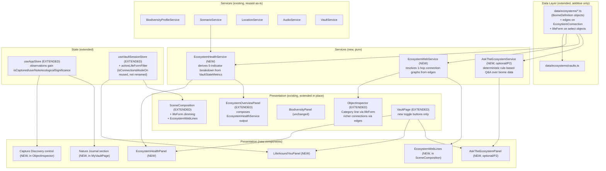
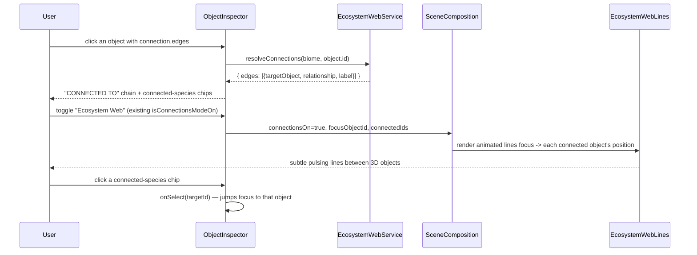
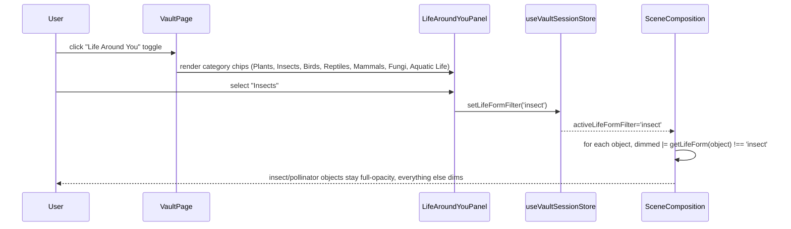
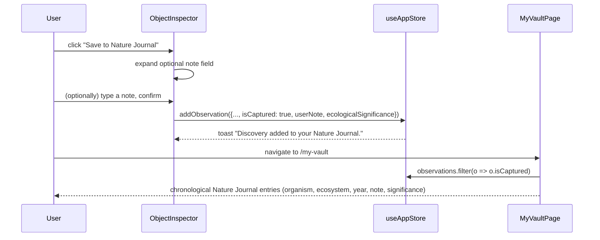

# Design Document: NatureVault Experience Expansion

## Overview

The biome architecture (`biome-architecture-expansion`) and the visual/content polish pass (`visual-qa-polish-pass`) are both complete. Between them, NatureVault already has: 8 architecturally distinct biomes on a shared `BiomeDefinition` pipeline, per-biome terrain/water/atmosphere/audio identity, a `BiodiversityProfileService` for derived species counts, a multi-region `LocationService` with an 8-region fallback dataset, a search+filter `DiscoverPage`, an `EcosystemOverviewPanel` with a derived health percentage, and 14–20 interactive objects per biome in the current year (already above the 10–15+ target).

This feature is **not** another biome/visual pass. It is the "killer experience" layer that turns NatureVault from "8 nice 3D scenes" into a coherent loop: **Explore → Understand → Connect → Compare → Imagine → Act**. Concretely, it adds five net-new systems (Ecosystem Health breakdown, Ecosystem Web, Life Around You biodiversity exploration mode, Capture Discovery, Nature Journal), one optional system (Ask the Ecosystem), and closes a small number of real gaps in existing systems (ObjectInspector's "Category" line and connected-species prominence). Everything else the user's brief asks for (biome-specific 3D quality, per-biome water/terrain/atmosphere, biome-specific audio, Take It Outside reliability, Explore page overhaul, per-biome object density) was verified against the current codebase and is **already implemented** — those items are scoped as verification/regression tasks only, not new work.

## What's Already Implemented (Gap Analysis)

This audit was performed by reading the two prior specs' design/requirements/tasks documents and the current source tree before any new design work below.

| User's item | Status | Evidence |
|---|---|---|
| 1. Ecosystem Health | **Partial — extend.** `EcosystemOverviewPanel` already derives a single blended `healthPercent` from `VaultStateMetrics`. Missing: the 5-indicator bar breakdown (Biodiversity/Habitat/Water/Vegetation/Human Pressure) and a way to see health while scrubbing the timeline without losing the panel once dismissed. | `EcosystemOverviewPanel.tsx`, `VaultStateMetrics` in `types/vault.ts` |
| 2/3. Ecosystem Web | **Net new.** `EnvironmentalObject.connection?.chain: string[]` exists but is a linear list of *display-name strings*, not object references, authored on only 9 objects across 2 of 8 biomes, with no click-to-highlight or 3D line visualization. | `types/vault.ts`, `ObjectInspector.tsx`'s existing "Ecosystem connections" section, grep results: `coastalWetland.ts` (3), `evergreenValley.ts` (6), all other biomes (0) |
| 4. Biodiversity Exploration Mode ("Life Around You") | **Partial — extend.** `BiodiversityPanel` + `activeBiodiversityFilter` + `SceneComposition`'s dimming logic already implement "select a category → non-matching objects dim, matching objects stay highlighted" — this is the exact mechanic the user is asking for. Gap: category granularity (6 categories: plants/birds/pollinators/wildlife/water/fungi) doesn't match the user's 7 requested categories (plants/insects/birds/reptiles/mammals/fungi/aquatic life), since `wildlife` conflates mammals and reptiles. | `BiodiversityPanel.tsx`, `SceneComposition.tsx`, `useVaultSessionStore.ts` |
| 5. Increase interactive discoveries (10–15+/biome) | **Already satisfied — verify only.** Measured current-year interactive object counts (non-null `biodiversityCategory`): evergreen-valley 15, coastal-wetland 17, alpine-ecosystem 15, grassland-savanna 15, desert 19, coral-reef 14, freshwater-lake 15, tropical-forest 20. All 8 biomes are within the existing `objectCountBudget.test.ts` `[20,60]` total-object budget. | Measured directly via a temporary Vitest run against `src/data/ecosystems/vaults.ts` |
| 6. Rich object detail panels | **Partial — extend.** `ObjectInspector` already has description, ecological role, habitat, diet, historical change, environmental pressures, related-species chips, and a connections section. Gaps: (a) no distinct taxonomic "Category" line (e.g. "Mammal") — only a rendering-kind label (e.g. "Animal") plus the biodiversity bucket emoji; (b) `relatedSpecies` is sparsely authored (12 objects total across all 8 biomes) so "2–4 connected species" isn't reliably shown. | `ObjectInspector.tsx`, grep results on `relatedSpecies:` |
| 7/8/9. Dramatic multi-year timeline + future scenario divergence | **Already satisfied — verify only.** Every biome has 6–7 years, two projected years (2050 and 2075) with distinct authored text, `ScenarioService.resolveMetricsForYear` already scales scenario divergence by elapsed time, `ScenarioSwitcher` already shows a derived "+N% represented biodiversity" impact summary with an "Illustrative simulation" disclaimer. | `ScenarioService.ts`, `ScenarioSwitcher.tsx`, all 8 `data/ecosystems/*.ts` files |
| 10/11. Capture Discovery / Nature Journal | **Partial — extend.** `useAppStore.observations` already logs an entry on every object click, but silently (no save moment, no confirmation, no user note field), and `MyVaultPage` only shows aggregate counts, never individual entries. | `useAppStore.ts`, `MyVaultPage.tsx` |
| 12. Take It Outside reliability ("never show Portland") | **Already fixed — verify only.** `LocationService.resolveLocation()` only ever returns a `city`/`region` from a live, successfully-resolved geocode; `matchRegion` picks the containing or nearest-centroid region from an 8-region dataset (Vadodara, Ahmedabad, Mumbai, Delhi, Bengaluru, Hyderabad, New York, Portland); denial/failure renders `LocationSelector`, never a silent default. | `LocationService.ts`, `regionLocations.ts`, `TakeItOutsidePanel.tsx` |
| 13. Nearby nature matches biome type | **Already implemented — verify only.** `getRegionByEcosystemType`/`ecosystemTypeKeywords` map every `EcosystemType` (`wetland`, `temperate-forest`, `desert`, `alpine`, `savanna`, `coral-reef`, `lake`, `tropical-forest`) to keyword filters against each region's curated location list, falling back to the full region list when no match exists (never an empty result). | `regionLocations.ts` |
| 14. Explore page overhaul | **Already implemented — verify only.** `DiscoverPage` has a search input (name/location/description), all 8 requested filter categories (Forest/Wetland/Desert/Mountain/Freshwater/Grassland/Marine/Tropical), and `EcosystemCard` shows a per-type gradient, species count, health dot, and years-tracked indicator. | `DiscoverPage.tsx`, `exploreFilters.ts`, `EcosystemCard.tsx` |
| 15. AI Nature Guide | **Net new, P2/optional.** No AI API key or environment variable exists anywhere in the project (`grep` for `VITE_`/`API_KEY`/`OPENAI`/`ANTHROPIC` returns nothing). Per the user's own instruction, the deterministic local rule-based answer generator is the primary deliverable, not a fallback. | Full-repo grep, `package.json` |
| 16–19. 3D quality, biome-specific water/terrain/atmosphere, audio | **Already implemented — no work in this feature.** `terrainStrategies` (5 strategies), water variants (`PondMarsh`/`CreekStream`/`LakeShoreline`/`Waterfall`/underwater-ambient), `AtmosphereRenderer` with `atmosphereDistinctness.test.ts` already asserting no two biomes share a `(fog.color, sun.color, skyTreatment)` tuple, and `AudioService` with a per-biome layer profile for all 8 biomes. | `terrainStrategies/`, `water/`, `atmosphere/`, `AudioService.ts`, `atmosphereDistinctness.test.ts` |
| 20. Performance | **Already implemented — new work stays within budget.** Route-level code splitting for `VaultPage` (`App.tsx`'s `lazy()`), instancing pattern for dense elements, `[20,60]` object budget enforced by test. This feature's additions (Ecosystem Web lines, Life Around You filter) are designed to add negligible cost (see Performance Considerations). | `App.tsx`, `objectCountBudget.test.ts` |

## Architecture



**Key architectural decisions:**

1. **Every new system is additive data + a new pure service + a new small component.** No existing type becomes required-field-breaking; no existing component is deleted or rewired away from its current callers. `BiomeDefinition`, `EnvironmentalObject`, `VaultStateMetrics`, and every existing service signature are extended with optional fields only.
2. **Ecosystem Web extends `EcosystemConnection` rather than replacing it.** The existing `chain: string[]` (display-name-only, non-referential) stays as the lightweight narrative fallback already rendered today. A new optional `edges?: EcosystemEdge[]` field — an array of `{ targetId, relationship, label? }` referencing real `EnvironmentalObject.id`s within the same biome — is added alongside it. This is the minimal shape change that lets the feature (a) resolve real 3D object positions to draw lines between, (b) know *what kind* of relationship exists (preys-on, pollinates, decomposes, shelters-in) instead of just an ordered label list, and (c) stay a 1-hop lookup rather than a full graph traversal, keeping the visualization "understandable" per the user's explicit constraint.
3. **Life Around You reuses the *exact* highlight/dim mechanism `BiodiversityPanel`/`SceneComposition` already implement**, rather than inventing a new visual language. It is a parallel filter dimension (`activeLifeFormFilter`, independent of `activeBiodiversityFilter`) using a new optional `lifeForm` field, with a documented fallback mapping from the existing `biodiversityCategory` so every object — even before any backfill — has a sensible Life Around You classification on day one.
4. **`lifeForm` does double duty**: it is both the Life Around You filter key *and* the ObjectInspector "Category" line (e.g. "Mammal", "Reptile", "Insect") the user's mockup asks for. One new field, two requirements satisfied, no duplicate taxonomy.
5. **Ecosystem Health is computed once, by one service, and consumed by two presentational surfaces** (`EcosystemOverviewPanel`'s one-time entry summary and the new persistent `EcosystemHealthPanel` toggle) — this avoids exactly the "second competing health display" the user's scoping guidance warns against, since `EcosystemOverviewPanel` becomes a thin consumer of `EcosystemHealthService`, not an independent computation.
6. **Capture Discovery extends the existing `Observation` shape and the existing `addObservation` call site**, rather than introducing a second storage system. Every object click still logs a passive `Observation` (unchanged behavior, preserves existing stats on `MyVaultPage`/`ImpactPage`); Capture Discovery adds one explicit action that calls the same store action with `isCaptured: true` plus the richer fields the Nature Journal needs.
7. **Ask the Ecosystem is fully self-contained and skippable.** It reads existing biome/object/scenario data through pure functions and renders through one new panel wired to one new toggle button. If never opened, it has zero effect on any other system — satisfying the requirement that it not entangle with or block P0/P1 work.

## Sequence Diagrams

### Ecosystem Web: selecting an object and seeing its connections



### Life Around You: filtering by life form



### Capture Discovery and Nature Journal



## Components and Interfaces

### 1. `types/vault.ts` (EXTENDED — `EcosystemConnection`, `LifeForm`)

```typescript
export type RelationshipKind =
  | 'preys-on' | 'preyed-on-by'
  | 'pollinates' | 'pollinated-by'
  | 'decomposes' | 'decomposed-by'
  | 'shelters-in' | 'shelters'
  | 'depends-on' | 'supports';

export interface EcosystemEdge {
  /** id of another EnvironmentalObject in the SAME biome. Unresolvable ids are skipped defensively. */
  targetId: string;
  relationship: RelationshipKind;
  /** Optional display override, e.g. "pollinates" instead of a generated label from relationship. */
  label?: string;
}

export interface EcosystemConnection {
  /** Existing linear display-name chain — unchanged, kept as the lightweight narrative fallback. */
  chain: string[];
  /** NEW, optional: referential 1-hop edges powering the interactive Ecosystem Web. */
  edges?: EcosystemEdge[];
}

/** Taxonomic/visual life-form classification, independent of BiodiversityCategory.
 *  Doubles as (a) the Life Around You filter key and (b) ObjectInspector's "Category" line. */
export type LifeForm = 'plant' | 'insect' | 'bird' | 'reptile' | 'mammal' | 'fungi' | 'aquatic';

export interface EnvironmentalObject {
  // ...all existing fields, unchanged...
  /** NEW, optional. See LifeForm. Falls back to a derived mapping from biodiversityCategory when absent. */
  lifeForm?: LifeForm;
}
```

No other field on `BiomeDefinition`/`EnvironmentalObject`/`VaultYearState` changes shape.

### 2. `services/EcosystemHealthService.ts` (NEW)

```typescript
export type HealthIndicatorKind = 'biodiversity' | 'habitat' | 'water' | 'vegetation' | 'humanPressure';

export interface HealthIndicator {
  kind: HealthIndicatorKind;
  label: string;   // "Biodiversity", "Habitat", "Water", "Vegetation", "Human Pressure"
  emoji: string;    // 🌿 🌳 💧 🌱 🏗️
  /** 0-1. For humanPressure, HIGHER means MORE pressure (bar fills as pressure increases). */
  value: number;
}

export interface EcosystemHealthBreakdown {
  overallScore: number; // 0-100, rounded
  indicators: HealthIndicator[];
  disclaimer: string; // EDUCATIONAL_SIMULATION_DISCLAIMER
}

export const EDUCATIONAL_SIMULATION_DISCLAIMER =
  'Educational simulation indicator — not a scientific assessment.';

export const EcosystemHealthService = {
  computeBreakdown(metrics: VaultStateMetrics): EcosystemHealthBreakdown;
};
```

**Derivation** (pure function of the four existing `VaultStateMetrics` fields — no new hand-authored per-biome value, consistent with the "derive, don't hand-author" principle already used for biodiversity counts and the existing overview health percentage):

- `biodiversity` = `metrics.biodiversityLevel`
- `water` = `metrics.waterLevel`
- `vegetation` = `metrics.vegetationDensity`
- `humanPressure` = `metrics.developmentLevel` (displayed as-is; a fuller bar means more pressure, matching the user's mockup where "Human Pressure" is the one indicator that reads as *bad* when full)
- `habitat` = `clamp01((metrics.vegetationDensity + (1 - metrics.developmentLevel)) / 2)` — habitat quality is modeled as intact, undeveloped, vegetated space; this is the one indicator that isn't a 1:1 copy of an existing metric, so it is the most important one to document: it captures "is there still contiguous natural cover for wildlife to live in," which is exactly the concept the user's example intends by "Habitat" and is not already represented directly by any of the other four bars.
- `overallScore` = `Math.round(((biodiversity + water + vegetation + (1 - humanPressure)) / 4) * 100)` — this **is** the existing `EcosystemOverviewPanel` health-percent formula, unchanged, so the two surfaces (overview panel and the new persistent panel) always agree.

Because this is a pure function of `metrics` (which already changes correctly across the timeline via `resolveMetricsForYear`), the breakdown automatically updates as the user scrubs the timeline or switches scenarios — no additional wiring needed beyond passing the current `metrics` in.

### 3. `services/EcosystemWebService.ts` (NEW)

```typescript
export interface ResolvedWebEdge {
  targetObject: EnvironmentalObject;
  relationship: RelationshipKind;
  label: string; // edge.label ?? a generated label from relationship, e.g. 'preys-on' -> 'Preys on'
}

export interface EcosystemWebGraph {
  focusObject: EnvironmentalObject;
  /** Direct (1-hop) edges FROM the focus object, resolved to real objects in the same biome. */
  outgoing: ResolvedWebEdge[];
  /** Direct (1-hop) edges from OTHER objects that reference the focus object as their target
   *  (i.e., "what depends on this" / "what this shelters" from the other side). */
  incoming: ResolvedWebEdge[];
}

export const EcosystemWebService = {
  /** Returns null if the object has no edges and nothing else references it (nothing to show). */
  resolveGraph(biome: BiomeDefinition, focusObjectId: string): EcosystemWebGraph | null;
};
```

**Behavior**: `outgoing` comes directly from `focusObject.connection?.edges`, filtered to edges whose `targetId` resolves to a real object in `biome.objects` (unresolvable ids — e.g. a stale id after a rename — are silently dropped, never a rendering error). `incoming` is computed by scanning every other object in the biome for an edge whose `targetId === focusObjectId`, so a shelter/food-source relationship is discoverable from either end without needing to be authored twice in opposite directions on both objects. Both lists are capped at a small display limit (6 total combined) purely at the presentation layer (`ObjectInspector`/`EcosystemWebLines`), not in the service, so the service always returns the true underlying data.

### 4. `services/AskTheEcosystemService.ts` (NEW, optional/P2)

```typescript
export interface AskAnswer {
  answer: string;
  /** Which data points grounded this answer, shown as a small "based on" footer for transparency. */
  groundedIn: string[];
}

export interface AskContext {
  biome: BiomeDefinition;
  year: number;
  metrics: VaultStateMetrics;
  scenarioId: string;
  selectedObject: EnvironmentalObject | null;
}

export const AskTheEcosystemService = {
  /** Fully deterministic, local, keyword/intent-based. Never calls a network API. */
  answerQuestion(context: AskContext, question: string): AskAnswer;
};
```

**Behavior** (deterministic intent classification, no ML/network call):
1. Normalize the question (lowercase, strip punctuation).
2. Match against a small ordered list of intent patterns (first match wins):
   - `/fewer|declin|less .*(bird|animal|wildlife)/` → **decline explanation**: composes an answer from `selectedObject?.environmentalPressures` (or, if none selected, the biome's most common pressure across currently-visible objects) plus `metrics.biodiversityLevel` trend framing.
   - `/what (happens|if).*(disappear|gone|lost)/` → **removal-impact**: uses `EcosystemWebService.resolveGraph` on the selected object (or the biome's most-connected object if none selected) to list what `incoming` edges (dependents) would lose their relationship, i.e. "X depends on this for shelter/food."
   - `/why.*(important|matter)/` → **importance**: returns `selectedObject.ecologicalRole` verbatim if an object is selected (this is exactly what that field already exists for), else a biome-level summary sentence.
   - `/what .* depend|who depends/` → **dependents**: same `incoming`-edges lookup as removal-impact, phrased as a direct list.
   - `/recover|restore|improve/` → **recovery**: contrasts `resolveMetricsForYear(biome.years, year, 'continue-as-is')` vs `'protect-and-restore'` (reusing `ScenarioService`, no new metrics logic) and names the biome's `protectAndRestore` scenario's `environmentalChanges`.
   - No match → **generic grounded fallback**: a one-paragraph summary of the current biome/year/health (via `EcosystemHealthService`), never a blank "I don't understand."
3. Every branch's `groundedIn` array names the concrete fields it used (e.g. `['desert-coyote-1.environmentalPressures', 'metrics.biodiversityLevel']`), so the panel can show *why* the answer says what it says — directly satisfying "the response should reference current biome / selected species / timeline state / ecosystem relationships / environmental pressures" without needing a real language model.

This is a pure, synchronous, framework-agnostic function — trivially testable and, per the user's own note, could be swapped for a real API call behind the same `answerQuestion` signature later without touching any caller, but that wiring is explicitly out of scope here.

### 5. `EcosystemHealthPanel.tsx` (NEW) — `src/components/Vault/EcosystemHealthPanel.tsx`

```typescript
interface EcosystemHealthPanelProps {
  metrics: VaultStateMetrics;
  onClose: () => void;
}
```

A persistent (not one-time-dismiss) side panel, toggled by a new "Health" button in `VaultPage`'s existing top-right toggle row (same visual pattern as the "Biodiversity"/"Story Mode" toggles). Renders `EcosystemHealthService.computeBreakdown(metrics)`'s `overallScore` as the "N / 100" headline plus one horizontal bar per `HealthIndicator` (emoji + label + bar), and the `EDUCATIONAL_SIMULATION_DISCLAIMER` beneath. Because it reads `metrics` (already animated/re-resolved on every year/scenario change by `VaultPage`), it updates live as the user scrubs the timeline or switches scenarios — this is what directly satisfies "the score should change when moving through the timeline" without requiring the user to keep the one-time entry overview open.

### 6. `EcosystemOverviewPanel.tsx` (EXTENDED — composition only, no new computation)

Replaces its inline `healthPercent` `useMemo` with `EcosystemHealthService.computeBreakdown(metrics)` and renders the same 5-indicator bars `EcosystemHealthPanel` renders (extracted into a small shared `HealthIndicatorBars` presentational sub-component used by both), so the one-time entry summary and the persistent panel are visually and numerically identical — never two competing health displays. No change to its existing dismiss-once-per-session behavior, key-features, or main-pressures sections.

### 7. `LifeAroundYouPanel.tsx` (NEW) — `src/components/Ecosystem/LifeAroundYouPanel.tsx`

```typescript
interface LifeAroundYouPanelProps {
  activeFilter: LifeForm | null;
  onSelectFilter: (form: LifeForm | null) => void;
}

export const lifeFormMeta: Record<LifeForm, { label: string; emoji: string }> = {
  plant: { label: 'Plants', emoji: '🌳' },
  insect: { label: 'Insects', emoji: '🐝' },
  bird: { label: 'Birds', emoji: '🐦' },
  reptile: { label: 'Reptiles', emoji: '🦎' },
  mammal: { label: 'Mammals', emoji: '🦌' },
  fungi: { label: 'Fungi', emoji: '🍄' },
  aquatic: { label: 'Aquatic Life', emoji: '🐟' },
};

/** Fallback used whenever object.lifeForm is absent, so every object has a sensible
 *  Life Around You classification even before any per-object backfill. */
export function getLifeForm(object: EnvironmentalObject): LifeForm {
  if (object.lifeForm) return object.lifeForm;
  switch (object.biodiversityCategory) {
    case 'plants': return 'plant';
    case 'pollinators': return 'insect';
    case 'birds': return 'bird';
    case 'water': return 'aquatic';
    case 'fungi': return 'fungi';
    case 'wildlife':
    default: return 'mammal';
  }
}
```

A small chip-row panel, structurally identical to `BiodiversityPanel`'s category grid but keyed on `LifeForm` instead of `BiodiversityCategory`, toggled by a new "Life Around You" button in `VaultPage`. Selecting a chip calls `setLifeFormFilter`. Deliberately a *separate* toggle/panel/store field from the existing Biodiversity View (`activeBiodiversityFilter`) rather than replacing it — both are legitimate, independently useful lenses over the same object list, and keeping them separate means zero risk of regressing the existing Biodiversity View's behavior or its tests.

### 8. `useVaultSessionStore.ts` (EXTENDED)

```typescript
interface VaultSessionState {
  // ...all existing fields, unchanged...
  activeLifeFormFilter: LifeForm | null;
  setLifeFormFilter: (form: LifeForm | null) => void;
}
```

`resetSession` additionally resets `activeLifeFormFilter` to `null`. `isConnectionsModeOn` (already existing) is **reused as-is** as the Ecosystem Web on/off toggle — no rename, no new field — since it already gates `ObjectInspector`'s connections section exactly the way Ecosystem Web needs to.

### 9. `SceneComposition.tsx` (EXTENDED)

- Accepts one new optional prop, `lifeFormFilter?: LifeForm | null`, threaded down from `VaultPage`.
- The existing per-object `dimmed` boolean computation gains one additional OR-condition: `dimmed = Boolean(biodiversityFilterMismatch) || Boolean(lifeFormFilter && getLifeForm(object) !== lifeFormFilter)`. Scenery objects (`biodiversityCategory === null`) are exempt from the life-form dimming the same way they're already exempt from biodiversity-filter dimming (a rock has no life form to filter by), preserving the existing "scenery always stays visible" behavior.
- Renders a new `<EcosystemWebLines />` when `interactive`, `connectionsOn` (passed down alongside the existing `selectedObjectId`), and a resolved `EcosystemWebGraph` for the current selection all exist.

### 10. `EcosystemWebLines.tsx` (NEW) — `src/components/Ecosystem/EcosystemWebLines.tsx`

```typescript
interface EcosystemWebLinesProps {
  graph: EcosystemWebGraph;
}
```

Renders one `<Line>` (from `@react-three/drei`, already a project dependency — no new package) per combined `outgoing`/`incoming` edge (capped at 6), from the focus object's `position` to each resolved `targetObject.position`, using a thin, semi-transparent, animated-dash material (`dashed`, animating `dashOffset` via `useFrame`, following the same lightweight animation pattern already used by `Water`'s shimmer and `Coral`'s sway — no new shader). Lines use a distinct, low-saturation gold tone consistent with the existing `vault-gold` accent already used for selection highlighting elsewhere, so the effect reads as "part of the UI language" rather than a new visual system. Capped at 6 total lines and only rendered for the single currently-selected object, directly satisfying "keep it visually understandable... not a giant unreadable network graph."

### 11. `ObjectInspector.tsx` (EXTENDED)

- New "Category" line, inserted directly under the existing kind/biodiversity-category header line: `{lifeFormMeta[getLifeForm(object)].label}` (e.g. "Mammal"), shown for every object with a non-null `biodiversityCategory` (scenery objects like rocks have no life form and keep the header exactly as today).
- "Ecosystem connections" section (existing, gated by `showConnections`) is extended: when `EcosystemWebService.resolveGraph(biome, object.id)` returns a non-null graph, render a new "Connected species" sub-section showing up to 4 chips (combining `outgoing`+`incoming`, deduplicated by target id), each chip showing the target's category emoji + name + relationship label, clickable to call `onSelect(targetId)` (jump-to-connection). This is rendered *above* the existing static `chain` rendering, which stays as-is for objects that only have `chain` and no `edges` (graceful degradation, no object regresses).
- A new "📸 Save to Nature Journal" button/section (see Capture Discovery below), placed after the connections section and before the viewing-year footer.

`ObjectInspector` needs `biome` (to pass to `EcosystemWebService`) and `onSelect` (to support jump-to-connection) as two new props from its current `{ object, year, onClose, showConnections }`; both are already available in `VaultPage` where it's rendered.

### 12. Capture Discovery — `types/observation.ts` (EXTENDED) + `useAppStore.ts` (EXTENDED)

```typescript
export interface Observation {
  id: string;
  objectId: string;
  ecosystemId: string;
  timestamp: number;
  notes: string;                    // existing auto-generated "Viewed X" text — unchanged
  category: BiodiversityCategory | 'general';

  // --- NEW optional fields (additive) ---
  isCaptured?: boolean;             // true only for explicit "Save to Nature Journal" actions
  userNote?: string;                // the user's own optional free-text note at capture time
  objectName?: string;              // denormalized so the Journal never needs a stale object lookup
  ecosystemName?: string;
  year?: number;                    // the year being viewed at capture time
  ecologicalSignificance?: string;  // snapshot of object.ecologicalRole at capture time
}
```

`addObservation` itself is unchanged (still `Omit<Observation, 'id' | 'timestamp'>` in, stamped id/timestamp out) — Capture Discovery simply passes more fields into the same existing action from a new call site, rather than adding a second store action. The existing per-click "Viewed X" call site in `VaultPage.handleSelectObject` is untouched, so every existing stat (`observations.length` on `MyVaultPage`/`ImpactPage`) keeps counting exactly as it does today.

### 13. Capture Discovery UI — `ObjectInspector.tsx` (EXTENDED, continued)

- "📸 Save to Nature Journal" button. Clicking expands an inline optional single-line note input plus a "Save" confirm button (no modal — keeps the inspector panel as the single interaction surface).
- On confirm, calls a new prop `onCapture: (note?: string) => void` (wired in `VaultPage` to `addObservation({ objectId, ecosystemId, notes: 'Captured discovery', category, isCaptured: true, userNote: note, objectName: object.name, ecosystemName: vault.name, year, ecologicalSignificance: object.ecologicalRole })`).
- A small transient toast/banner reading exactly **"Discovery added to your Nature Journal."** appears (local component state, auto-dismiss after ~3s — no new global toast system needed for a single message).

### 14. Nature Journal — `MyVaultPage.tsx` (EXTENDED)

Adds a new "My Nature Journal" section (above the existing "explored ecosystems" list, since captured discoveries are the more specific, higher-intent content): reads `observations.filter(o => o.isCaptured)`, sorted descending by `timestamp`, grouped by calendar date (`toLocaleDateString`), each entry rendered as a card with: the biodiversity category emoji, `objectName`, `ecosystemName`, `year`, `userNote` (if present, else omitted — not a fake empty quote block), and an "Why it matters" line from `ecologicalSignificance`. Empty state ("No discoveries captured yet — click 'Save to Nature Journal' on any object you find interesting.") shown when the filtered list is empty, consistent with the page's existing empty-state pattern for explored ecosystems.

## Data Models

Summarized from the Components section above (full shapes there): `RelationshipKind`, `EcosystemEdge`, extended `EcosystemConnection`, `LifeForm`, extended `EnvironmentalObject` (+`lifeForm`), `HealthIndicatorKind`, `HealthIndicator`, `EcosystemHealthBreakdown`, `ResolvedWebEdge`, `EcosystemWebGraph`, `AskAnswer`, `AskContext`, extended `Observation` (+`isCaptured`/`userNote`/`objectName`/`ecosystemName`/`year`/`ecologicalSignificance`).

## Algorithmic Pseudocode

### `EcosystemHealthService.computeBreakdown`

```pascal
FUNCTION computeBreakdown(metrics)
INPUT: metrics (VaultStateMetrics)
OUTPUT: EcosystemHealthBreakdown

BEGIN
  biodiversity <- metrics.biodiversityLevel
  water <- metrics.waterLevel
  vegetation <- metrics.vegetationDensity
  humanPressure <- metrics.developmentLevel
  habitat <- clamp01((vegetation + (1 - humanPressure)) / 2)

  overallScore <- ROUND(((biodiversity + water + vegetation + (1 - humanPressure)) / 4) * 100)

  RETURN {
    overallScore,
    indicators: [
      { kind: 'biodiversity', label: 'Biodiversity', emoji: '🌿', value: biodiversity },
      { kind: 'habitat',      label: 'Habitat',      emoji: '🌳', value: habitat },
      { kind: 'water',        label: 'Water',        emoji: '💧', value: water },
      { kind: 'vegetation',   label: 'Vegetation',   emoji: '🌱', value: vegetation },
      { kind: 'humanPressure', label: 'Human Pressure', emoji: '🏗️', value: humanPressure },
    ],
    disclaimer: EDUCATIONAL_SIMULATION_DISCLAIMER,
  }
END
```

**Precondition:** each field of `metrics` is in `[0,1]` (guaranteed today by `applyScenario`'s `clamp01`, unchanged by this feature).
**Postcondition:** `overallScore ∈ [0,100]`; every `indicator.value ∈ [0,1]`; the function is pure — identical `metrics` input always yields an identical breakdown, so re-renders never flicker and the two consuming panels never disagree.

### `EcosystemWebService.resolveGraph`

```pascal
FUNCTION resolveGraph(biome, focusObjectId)
INPUT: biome (BiomeDefinition), focusObjectId (string)
OUTPUT: EcosystemWebGraph or null

BEGIN
  focusObject <- FIND o IN biome.objects WHERE o.id = focusObjectId
  IF focusObject IS UNDEFINED THEN RETURN null

  outgoing <- []
  FOR each edge IN (focusObject.connection?.edges OR []) DO
    target <- FIND o IN biome.objects WHERE o.id = edge.targetId
    IF target IS DEFINED THEN
      outgoing.push({ targetObject: target, relationship: edge.relationship, label: edge.label OR generateLabel(edge.relationship) })
    END IF
  END FOR

  incoming <- []
  FOR each other IN biome.objects WHERE other.id != focusObjectId DO
    FOR each edge IN (other.connection?.edges OR []) DO
      IF edge.targetId = focusObjectId THEN
        incoming.push({ targetObject: other, relationship: edge.relationship, label: edge.label OR generateLabel(edge.relationship) })
      END IF
    END FOR
  END FOR

  IF outgoing IS EMPTY AND incoming IS EMPTY THEN RETURN null
  RETURN { focusObject, outgoing, incoming }
END
```

**Precondition:** `biome.objects` contains no two objects with the same `id` (existing, already-relied-upon invariant across the codebase).
**Postcondition:** every `ResolvedWebEdge.targetObject` in the result is a real member of `biome.objects` (unresolvable `targetId`s are silently excluded, never null/undefined in the output — no rendering-time null check needed downstream); the function is a pure read of `biome` (no mutation), and calling it twice with the same arguments returns equal results (structurally), which is what lets `EcosystemWebLines` safely recompute on every render without flicker.

### `AskTheEcosystemService.answerQuestion` (intent dispatch, abbreviated)

```pascal
FUNCTION answerQuestion(context, question)
INPUT: context (AskContext), question (string)
OUTPUT: AskAnswer

BEGIN
  normalized <- LOWERCASE(TRIM(question))

  FOR each (pattern, handler) IN INTENT_PATTERNS DO   // ordered, first match wins
    IF normalized MATCHES pattern THEN
      RETURN handler(context)
    END IF
  END FOR

  RETURN genericGroundedFallback(context)   // ALWAYS returns a data-grounded answer, never "I don't understand"
END
```

**Precondition:** `context.biome` is a valid, loaded `BiomeDefinition` (always true when the panel is open, since it can only open from within a loaded Vault).
**Postcondition:** the function always returns a non-empty `answer` string and a non-empty `groundedIn` array (even the generic fallback names `context.biome.name`/`context.year`/the health breakdown it used) — there is no code path that returns an empty or generic "I don't know" response, since `genericGroundedFallback` always has at least the current biome/year/metrics to describe.

## Correctness Properties

*A property is a characteristic or behavior that should hold true across all valid executions of a system — a formal statement about what the system should do.*

The prework analysis behind this section considered every acceptance criterion in requirements.md individually. Several criteria collapsed into a single property during reflection: 1.1/1.2/1.5/1.7 all describe the same underlying purity/boundedness guarantee of `EcosystemHealthService.computeBreakdown` and are expressed as one property (P1) rather than four; 5.1/5.2/5.4 are UI-presence criteria with no meaningful generated-input variation and are covered by example tests instead of a property; and 12.1–12.4 are exact restatements of P1, P3, P6, and P10 respectively (the "Correctness and regression safety" requirement intentionally mirrors the feature's own properties back as an explicit regression gate, so no new property is needed for them — they are cross-referenced onto the properties they restate).

### Property 1: Health breakdown is a pure, bounded function of metrics

For any valid `VaultStateMetrics` (all four fields in `[0,1]`), `EcosystemHealthService.computeBreakdown(metrics).overallScore` is in `[0,100]`, every indicator's `value` is in `[0,1]`, and calling `computeBreakdown` twice with the same metrics returns an identical breakdown — including when that same computation is reused by `EcosystemOverviewPanel`, so the two surfaces never disagree for the same metrics.

**Validates: Requirements 1.1, 1.2, 1.5, 1.7, 12.1**

### Property 2: Health breakdown varies only with metrics, never with the year number itself

For any biome and any two distinct years (or the same year under two different scenarios) that resolve to different `VaultStateMetrics`, `EcosystemHealthService.computeBreakdown` applied to each produces breakdowns that differ exactly where the underlying metrics differ, and produces identical breakdowns whenever the underlying metrics are identical.

**Validates: Requirements 1.3, 1.4**

### Property 3: Web graph resolution never returns a dangling reference

For any biome and any object id in that biome, `EcosystemWebService.resolveGraph` never returns a `ResolvedWebEdge` whose `targetObject` is not a member of that same biome's `objects` array, and any edge whose `targetId` does not resolve is silently excluded rather than causing an error.

**Validates: Requirements 2.2, 12.2**

### Property 4: Web graph is symmetric across outgoing/incoming

For any biome and any two objects A and B where A has an edge with `targetId = B.id`, calling `resolveGraph(biome, B.id)` includes an entry in its `incoming` list whose `targetObject.id === A.id`, without B needing its own edge back to A authored explicitly.

**Validates: Requirements 2.4**

### Property 5: Ecosystem Web visualization stays within its display cap

For any resolved `EcosystemWebGraph`, the number of connection lines rendered by `EcosystemWebLines` never exceeds 6, and the number of connected-species entries shown in the object detail panel never exceeds 4, regardless of how many total edges the underlying graph contains.

**Validates: Requirements 3.1, 3.3, 3.5**

### Property 6: Life form resolution is total (every object classifiable)

For any `EnvironmentalObject` in any biome, `getLifeForm(object)` always returns a defined `LifeForm` value (never `undefined`/`null`), whether or not `object.lifeForm` is explicitly set.

**Validates: Requirements 4.1, 12.3**

### Property 7: Life Around You dimming matches filter selection, with scenery exempt

For any object and any active `LifeForm` filter: if the object has a non-null `biodiversityCategory`, it is rendered dimmed if and only if `getLifeForm(object) !== activeFilter`; if the object has a null `biodiversityCategory` (purely decorative scenery), it is never dimmed by the life-form filter regardless of its fallback-resolved life form. The same equivalence (dimmed iff life-form mismatch, for non-null-category objects) also governs whether the ObjectInspector's "Category" line is shown and what text it shows.

**Validates: Requirements 4.3, 4.4, 6.1, 6.2**

### Property 8: Life Around You and Biodiversity View filters are independent

For any sequence of calls to `setLifeFormFilter` and `setBiodiversityFilter` (the existing action) in any interleaved order, each store field always reflects only its own most recent call — a call to one setter never changes the other field's current value.

**Validates: Requirements 4.5**

### Property 9: Capture Discovery stores the correct field snapshot

For any object, biome, year, and optional user note, confirming a capture produces an `Observation` whose `objectName`, `ecosystemName`, `year`, `userNote`, and `ecologicalSignificance` fields exactly match the object/context values at the moment of capture, and whose `isCaptured` field is `true`.

**Validates: Requirements 5.3**

### Property 10: Capture Discovery preserves passive-observation counting

For any sequence of object selections followed by zero or more explicit "Save to Nature Journal" actions on distinct objects, the total count of `observations` entries equals the number of selections, and the count of entries with `isCaptured === true` equals the number of explicit captures — a capture never removes, duplicates without intent, or otherwise corrupts the passive click-driven entries.

**Validates: Requirements 5.7, 12.4**

### Property 11: Nature Journal shows only captured discoveries, newest first

For any set of `observations` containing a mix of passive and captured entries with arbitrary timestamps, the Nature Journal's rendered list contains exactly the entries with `isCaptured === true`, sorted in descending timestamp order.

**Validates: Requirements 5.5**

### Property 12: Ask the Ecosystem never returns an empty answer

For any `AskContext` (any loaded biome/year/metrics, with or without a selected object) and any question string (including empty, gibberish, or unrecognized text), `AskTheEcosystemService.answerQuestion` returns synchronously (no network call, no unresolved Promise) with a non-empty `answer` and a non-empty `groundedIn` array.

**Validates: Requirements 7.2, 7.4, 7.6**

### Property 13: Object density remains within budget after this feature's additions (Regression)

For every biome in `vaults`, `objects.length` remains within `[20, 60]` and the current-year interactive (non-null `biodiversityCategory`) object count remains at or above 10, after any `lifeForm`/`edges` field-only backfill introduced by this feature.

**Validates: Requirements 8.1, 8.2**

### Property 14: Scenario divergence scaling still holds (Regression)

For any present year `p` and any two projected years `y1 < y2` with `y1, y2 > p`, the magnitude of the scenario-scaled modifier applied at `y2` is greater than or equal to the magnitude applied at `y1` under the same scenario, and the scenario-impact percentage summary shown at any projected year always equals the independently-recomputed difference between the two scenarios' `resolveMetricsForYear` outputs at that year.

**Validates: Requirements 9.2, 9.3**

### Property 15: Location honesty and type-matched fallback still hold (Regression)

`LocationService.resolveLocation()` never returns a `city`/`region` value unless `status === 'resolved'` from a live geocode; and `getRegionByEcosystemType(ecosystemType, regionId)` always returns a non-empty list when the resolved region itself has any locations (falling back to the full regional list when no type-keyword match exists), so the suggestions are never empty and never falsely attributed to a live location that wasn't actually resolved.

**Validates: Requirements 10.1, 10.4**

### Property 16: Explore search substring round-trip still holds (Regression)

For any ecosystem record and any substring taken from that ecosystem's `name`, `location`, or `description` field, calling `filterEcosystems` with that substring as the query (and no active filters) still includes that ecosystem in the result.

**Validates: Requirements 11.1**

## Error Handling

| Scenario | Handling |
|---|---|
| `EcosystemConnection.edges` contains a `targetId` that doesn't exist in the biome (typo, stale id after a future rename) | Silently excluded by `EcosystemWebService.resolveGraph` (Property 3) — no rendering error, no console warning needed since this is a data-authoring concern caught by a unit test, not a runtime user-facing failure. |
| Selected object has no `connection` at all (most scenery/background objects) | `resolveGraph` returns `null`; `ObjectInspector` simply omits the "Connected species" sub-section and falls back to the existing `chain`-only rendering if `chain` is present, or omits the whole connections section if neither exists (unchanged from today). |
| User toggles "Ecosystem Web" (`isConnectionsModeOn`) with no object selected | No lines render (there is no focus object); the toggle is a no-op until an object is selected, consistent with how the existing connections-chain rendering already behaves. |
| User applies both Biodiversity View and Life Around You filters simultaneously with no overlap (e.g. category "Water" and life form "Insect") | Every object is dimmed (both filters fail for every object) — a legitimate, if visually uninteresting, degenerate case; not an error. |
| `AskTheEcosystemService.answerQuestion` receives an empty string or pure whitespace | Matches no intent pattern; falls through to `genericGroundedFallback`, which always succeeds (Property 9). |
| User captures the same object to the Nature Journal twice | Allowed — creates two separate journal entries (e.g. "I found this again a year later, in the future scenario"), each with its own `year`/`userNote`/`timestamp`; not deduplicated, since a repeat capture at a different year or under a different scenario is meaningful, not a bug. |
| `lifeForm` is absent on an object (the common case pre-backfill) | `getLifeForm` always falls back to a derived value from `biodiversityCategory` (Property 5) — never `undefined`, so Life Around You and the ObjectInspector "Category" line work correctly for every object from day one, even objects never explicitly backfilled. |
| `EcosystemHealthPanel` opened on a biome/year combination with all-zero metrics (defensive; should not occur given authored data) | Renders `0 / 100` and all-empty bars — no division by zero (the formula has a constant divisor of 4), no exception. |

## Testing Strategy

The project already has Vitest + fast-check configured, and no `@testing-library/react` DOM-render harness (confirmed by reading `ScenarioSwitcher.test.ts`/`EcosystemCard.test.ts`/`TakeItOutsidePanel.test.ts`, which test pure logic plus source-string assertions against the `.tsx` files rather than rendering components). This feature follows the same established dual approach.

### Unit tests
- `EcosystemHealthService.computeBreakdown`: fixed metrics fixtures asserting exact indicator values and the `overallScore` formula, including the all-zero and all-max edge cases.
- `EcosystemWebService.resolveGraph`: fixed small biome fixtures asserting outgoing/incoming resolution, dangling-id exclusion, and the `null` case for objects with no edges/incoming references.
- `getLifeForm`: exhaustive fallback-mapping table test (every `BiodiversityCategory` value plus `null` maps to a defined `LifeForm`), plus explicit-`lifeForm` override precedence.
- `AskTheEcosystemService.answerQuestion`: one fixed example per intent pattern (matching the user's own 5 example questions) plus the unrecognized-input fallback case.
- Data-authoring guard: assert every biome has at least one object with `connection.edges` forming a connected chain of length >= 3 (so Ecosystem Web has something meaningful to show in every biome, per the user's explicit "vary by ecosystem, not generic" requirement), and that `objects.length` stays in `[20,60]` after this feature's field-only additions (extends the existing `objectCountBudget.test.ts`).
- Regression tests confirming already-implemented items stay correct: a targeted `LocationService`/`regionLocations` test asserting a non-Portland, non-matching-region coordinate never surfaces a Portland-labeled card (Requirement 8), and an `exploreFilters`/`EcosystemCard` test re-confirming all 8 filter categories and per-card indicators remain present (Requirement 9) — both written as *new, additive* regression tests rather than modifications to the existing passing test files from the prior specs.

### Property-based tests (fast-check)
- Property 1/2 (health breakdown bounds and consistency): random `VaultStateMetrics` fixtures.
- Property 3/4 (web graph referential integrity and symmetry): random small biome fixtures with random edge sets, including deliberately dangling `targetId`s.
- Property 5/6 (life-form totality and dimming correctness): random objects with/without `lifeForm`, random active filters.
- Property 7 (capture-vs-passive counting): random sequences of select/capture actions.

### Manual/integration checklist
For each of the 8 biomes: enter the Vault, open the Health panel and confirm it updates while dragging the timeline and switching scenarios; select an object with edges, toggle Ecosystem Web, confirm lines render and connected-species chips jump-select correctly; toggle Life Around You through each of the 7 categories and confirm the right objects stay highlighted; capture at least one discovery and confirm the toast and the Nature Journal entry; open Ask the Ecosystem (if built) and try each of the 5 example questions; run Take It Outside with geolocation denied and with a mocked non-Portland location to re-confirm no regression; run Explore's search and all 8 filters to re-confirm no regression. Record and fix any console error or dead-end control found.

## Performance Considerations

- `EcosystemWebLines` renders at most 6 `<Line>` elements, only for the single currently-selected object, only while the existing `isConnectionsModeOn` toggle is on — negligible additional draw calls, no new shader, no new dependency (`@react-three/drei`'s `Line` is already available).
- Life Around You's dimming check (`getLifeForm(object) !== activeFilter`) is an O(1) switch/field-read added to a per-object loop that already runs today for the existing biodiversity-filter dimming — no new pass over the object list, no new render tree branch.
- `EcosystemHealthService`/`EcosystemWebService`/`AskTheEcosystemService` are all pure, synchronous, allocation-light functions operating on already-in-memory biome data — no new network calls, no new async loading states.
- Data additions (`edges`, `lifeForm`) are optional fields on existing object entries, not new `EnvironmentalObject` instances, so the existing `[20,60]` per-biome object-count budget and the existing instancing patterns are entirely unaffected (Property 10).
- `AskTheEcosystemPanel`/`EcosystemHealthPanel`/`LifeAroundYouPanel` are ordinary 2D DOM overlays (same pattern as the existing `BiodiversityPanel`/`ObjectInspector`), not new Canvas/R3F trees, so they add no 3D render cost when closed and minimal cost when open.

## Security Considerations

- Capture Discovery's `userNote` is free-text user input rendered back to the same user on `MyVaultPage` — rendered as plain text (React's default escaping), never `dangerouslySetInnerHTML`, so no XSS surface is introduced.
- `AskTheEcosystemService` makes no network calls and reads no external input beyond the user's own typed question and already-trusted, bundled biome data — there is no API key, no credential, and no new attack surface to introduce, consistent with the user's explicit "never make the entire product dependent on an API key" instruction.
- No new persisted field contains PII; `userNote` is the user's own free-text annotation about their own exploration, stored only in their own browser's `localStorage` via the existing `useAppStore` persistence, exactly like every other field already persisted there.

## Dependencies

- **No new runtime dependencies.** Ecosystem Web lines reuse `@react-three/drei`'s existing `Line` export. Everything else is plain TypeScript/React using patterns already established in the codebase.
- **No new devDependencies.** `vitest`/`fast-check` are already present and reused as-is.
- **AI Nature Guide has no dependency on any AI/LLM API, key, or SDK** — it is a fully local, deterministic, rule-based service, per explicit user instruction and confirmed by this design's investigation that no such configuration exists anywhere in the project.
