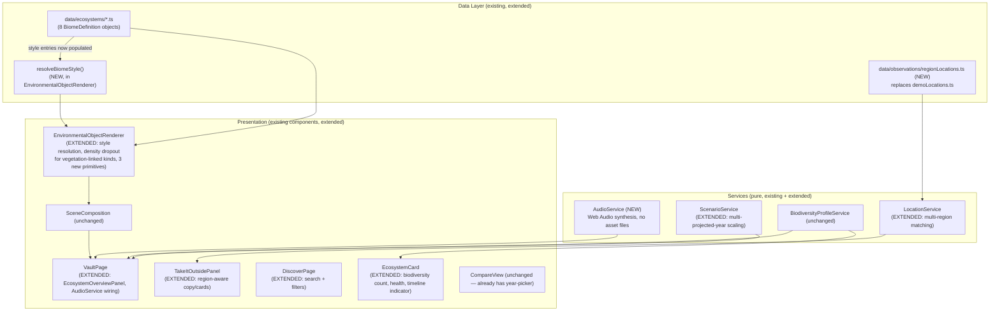
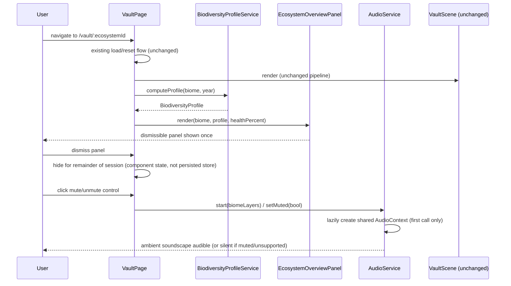
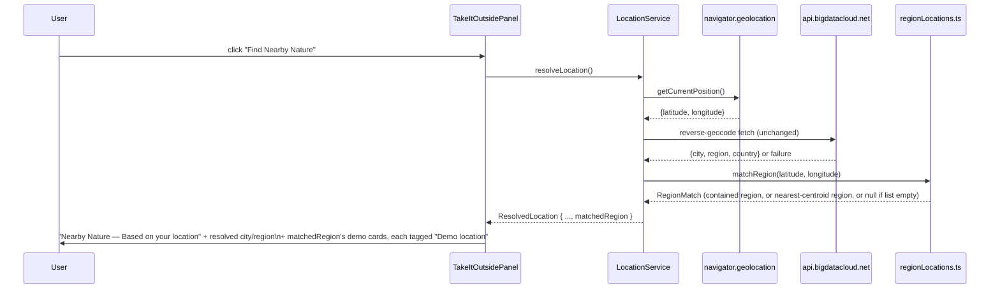

# Design Document: Visual QA & Polish Pass

## Overview

This is a polish/integration pass over the 8 biomes and supporting systems delivered by `biome-architecture-expansion`. No new architecture is introduced: every change here is expressed through the existing `BiomeDefinition` data model, the existing `terrainStrategies`/water-variant/`AtmosphereRenderer` registries, the existing `EnvironmentalObjectRenderer` dispatch pattern, and the existing `LocationService`/`ScenarioService`/`Timeline`/`BiodiversityProfileService` services.

The audit performed while writing these requirements found one structural gap worth calling out up front: **`BiomeDefinition.style` (`BiomeStyle`/`BiomeStyleEntry`) is defined in `types/biome.ts` but is never read anywhere in the rendering pipeline.** `EnvironmentalObjectRenderer` passes no color/variant override to `Tree`, `Rock`, `MeadowPatch`, `ReedCluster`, or `Pollinator` — every biome's trees are the same green, every biome's rocks are the same grey. This is the single biggest lever for "biome differentiation" and is addressed first (Requirement 1/2), because several other requirements (savanna tall grass via `MeadowPatch`, reef kelp via `ReedCluster`, biome-tinted rocks) depend on it existing.

The rest of the work is: (a) filling specific content gaps per biome (missing required elements called out in the requirements), (b) generalizing two pure services (`ScenarioService` for multi-projected-year divergence, `LocationService` for multi-region fallback), (c) two net-new but architecturally-consistent additions (`AudioService`, `EcosystemOverviewPanel`), (d) a `DiscoverPage` search/filter overhaul, and (e) a QA/performance pass.

## Architecture



**Key decisions:**

1. **Style resolution is a new pure function, not a new component.** `resolveBiomeStyle(style, kind, variant)` lives alongside `EnvironmentalObjectRenderer` and is called once per rendered object. This directly wires up the design that `biome-architecture-expansion` specified but never implemented.
2. **Density dropout is generalized, not duplicated.** The existing `WILDLIFE_KINDS` seeded-threshold mechanism in `EnvironmentalObjectRenderer` becomes two sets — `WILDLIFE_KINDS` (gated by `biodiversityLevel`, gains `crab`/`turtle`) and a new `VEGETATION_DENSITY_KINDS` (gated by `vegetationDensity`, covers `cactus`/`coral`/`tropicalFlower`/`termiteMound`/`anemone`) — both driven by the same `seededRange`-based threshold helper, extracted into a small shared function so the logic isn't copy-pasted.
3. **Three new primitives (`Crab`, `Turtle`, `Anemone`), not a generalized "critter" component.** Consistent with the existing one-primitive-per-kind pattern (`Frog`, `Fungi`, `TermiteMound`, etc.) — each is small, single-purpose, and follows an existing sibling's structure (e.g. `Crab` follows `Frog`'s idle+hop pattern scaled down and widened; `Turtle` follows `Animal`'s quadruped pattern flattened for swimming; `Anemone` follows `Coral`'s instanced-branch pattern with a swaying tentacle look).
4. **`ScenarioService.resolveMetricsForYear` gains a time-scaled modifier, not a new function.** The existing function's signature is unchanged; internally, when the requested year is a projected year, the scenario modifier is scaled by `(requestedYear - presentYear) / (firstProjectedYear - presentYear)` instead of being applied at full strength unconditionally. For biomes with exactly one projected year this ratio is always `1`, so existing single-projection biomes (which is all of them today) are visually unaffected until a second projected year is authored.
5. **`LocationService` region matching replaces the single Portland bounding box with a small ordered list of region records**, each with its own bounding box, centroid, and demo-location list. `isWithinDemoRegion: boolean` on `ResolvedLocation` becomes `matchedRegion: RegionMatch | null` (kept as an additive field; existing `isWithinDemoRegion` is derived from it for backward compatibility with any code reading it directly, though `TakeItOutsidePanel` is updated to read `matchedRegion`).
6. **`AudioService` is a new, small, synthesis-only module — no audio asset files, no new npm dependency.** Every "layer" (wind, birds, water, insects, rain, underwater tone) is a short chain of native Web Audio nodes (`OscillatorNode`/buffered white-noise `AudioBufferSourceNode` → `BiquadFilterNode` → `GainNode`) that loops indefinitely at low CPU cost. This avoids licensing/attribution concerns entirely and keeps the bundle size impact near zero, which matters given the build already warns about a >500KB main chunk (Requirement 9.2 addresses that chunk separately via route-level code splitting).
7. **`EcosystemOverviewPanel` is a new presentational component, computed entirely from existing services.** It reads `BiodiversityProfileService.computeProfile(biome, year)` for species count and derives "health %" from the current year's resolved `VaultStateMetrics` (a simple weighted average — see Algorithmic Pseudocode) rather than introducing a new hand-authored per-biome field, keeping it consistent with the "derive, don't hand-author" principle already used for biodiversity counts.
8. **`DiscoverPage` search/filter state is local component state (`useState`), not a new store slice.** It doesn't need to persist across navigation (unlike `useAppStore`'s demo-mode/exploration data), so a dedicated store slice would be unnecessary complexity for a page-local UI concern.

## Sequence Diagrams

### Entering a Vault: overview panel + audio + existing scene pipeline



### Resolving a multi-region "Take It Outside" location



## Components and Interfaces

### 1. `resolveBiomeStyle` — `src/components/Ecosystem/resolveBiomeStyle.ts` (NEW)

```typescript
import type { BiomeStyle, BiomeStyleEntry } from '../../types/biome';
import type { ObjectKind } from '../../types/vault';

/** Variant-specific entry wins over a kind-only entry; undefined if the biome declares no override. */
export function resolveBiomeStyle(style: BiomeStyle, kind: ObjectKind, variant?: string): BiomeStyleEntry | undefined {
  if (variant) {
    const exact = style.entries.find((e) => e.kind === kind && e.variant === variant);
    if (exact) return exact;
  }
  return style.entries.find((e) => e.kind === kind && !e.variant);
}
```

This is the exact resolver design.md (biome-architecture-expansion) specified but never wired in. It is a pure function, easy to property-test.

### 2. `EnvironmentalObjectRenderer.tsx` (EXTENDED)

- Accepts the owning `biome.style` (passed down from `SceneComposition`, which already has `biome` in scope) as a new prop `style: BiomeStyle`.
- For `tree`/`canopyTree`/`rock`/`reed`/`plant`/`pollinator` cases, calls `resolveBiomeStyle(style, object.kind, object.variant)` and passes `colorOverride` (a new optional prop threaded onto `Tree`, `Rock`, `MeadowPatch`, `ReedCluster`, `Pollinator` — each already computes a `selected`-derived color internally, so `colorOverride` becomes the new "unselected" base color instead of the hardcoded literal, with `selected`/`highlighted` states still taking precedence exactly as today).
- Two density-gating sets replace the current single `WILDLIFE_KINDS` check:
  ```typescript
  const WILDLIFE_KINDS = new Set(['bird', 'animal', 'frog', 'crab', 'turtle']);
  const VEGETATION_DENSITY_KINDS = new Set(['cactus', 'coral', 'tropicalFlower', 'termiteMound', 'anemone']);

  function seededDropoutThreshold(position: [number, number, number]): number {
    return seededRange(position[0] * 13 + position[2] * 7, 0.15, 0.55);
  }
  ```
  `WILDLIFE_KINDS` objects are hidden when `biodiversityLevel < seededDropoutThreshold(position)` (unchanged logic, now shared via the extracted helper). `VEGETATION_DENSITY_KINDS` objects use the same helper gated by `vegetationDensity` instead. This satisfies Requirement 2.1/2.2 without introducing a second, differently-tuned threshold formula.
- Three new switch cases: `crab` → `Crab`, `turtle` → `Turtle`, `anemone` → `Anemone`.

### 3. New primitives

- **`Crab.tsx`** (`src/components/Ecosystem/Crab.tsx`) — follows `Frog.tsx`'s structure: a small flattened body (box or squashed sphere) plus two small claw meshes, idling with an occasional sideways-scuttle animation (`Math.sin` position offset on the X axis instead of `Frog`'s vertical hop). Used by Coastal Wetland.
- **`Turtle.tsx`** (`src/components/Ecosystem/Turtle.tsx`) — follows `Animal.tsx`'s quadruped-box structure but flattened (wide shallow shell dome + four short flipper-boxes), with a slow up/down bob like `Animal`'s idle bob, scaled for underwater use. Used by Coral Reef.
- **`Anemone.tsx`** (`src/components/Ecosystem/Anemone.tsx`) — follows `Coral.tsx`'s instanced-branch pattern (base point + N instanced cone/cylinder "tentacles" swaying via `useFrame`), but shorter, thinner, and with a faster, more erratic sway to read as soft tentacles rather than rigid coral branches. Used by Coral Reef.

All three take the standard primitive prop shape (`position`, `selected`, `dimmed`, `onClick`, `onPointerOver`, `onPointerOut`) plus an optional `colorOverride` wired from `resolveBiomeStyle`.

### 4. `ObjectInspector.tsx` (EXTENDED — `kindLabel` map only)

Adds three entries: `crab: 'Crab'`, `turtle: 'Sea Turtle'`, `anemone: 'Sea Anemone'`. No other changes — the section-rendering logic already handles any object with the relevant optional fields populated (per Requirement 3.3, unchanged).

### 5. `types/vault.ts` (EXTENDED — `ObjectKind` union only)

```typescript
export type ObjectKind =
  | /* ...existing values... */
  | 'crab'
  | 'turtle'
  | 'anemone';
```

Additive only; no other type changes. `EnvironmentalObject`, `BiomeDefinition`, etc. are unchanged.

### 6. `ScenarioService.ts` (EXTENDED)

```typescript
export function resolveMetricsForYear(
  baselineByYear: { year: number; metrics: VaultStateMetrics }[],
  year: number,
  scenarioId?: string,
): VaultStateMetrics {
  const state = baselineByYear.find((y) => y.year === year);
  if (!state) return baselineByYear[baselineByYear.length - 1].metrics;

  const presentYear = getPresentYear(baselineByYear); // NEW helper — see below
  const projectedYears = baselineByYear.map((y) => y.year).filter((y) => y > presentYear).sort((a, b) => a - b);
  const isProjectedYear = projectedYears.includes(year);

  if (isProjectedYear && scenarioId) {
    const scenario = getScenarioById(scenarioId);
    const previous = baselineByYear.find((y) => y.year === presentYear)?.metrics ?? state.metrics;
    if (scenario) {
      const firstProjectedYear = projectedYears[0];
      const scale = firstProjectedYear === presentYear ? 1 : (year - presentYear) / (firstProjectedYear - presentYear);
      return applyScenario(previous, scenario, scale);
    }
  }
  return state.metrics;
}
```

- **`getPresentYear(baselineByYear)`**: the largest year that is `< 2050` (the feature's definition of "projected year" per the Glossary), or the second-to-last year if all years are `>= 2050` (defensive fallback — no authored biome triggers this branch). This replaces the previous "the previous entry in the array" assumption, which implicitly assumed exactly one future year existed at the end of the array.
- **`applyScenario` gains an optional third parameter `scale: number = 1`**, multiplying each modifier's percentage-point delta before it's applied: `vegetationDensity: clamp01(baseline.vegetationDensity + (modifiers.forestCoverage * scale) / 100)`, etc. Existing call sites that don't pass `scale` are unaffected (default `1`, matching current behavior exactly) — this is the mechanism that keeps single-projected-year biomes visually identical to today (Requirement 5.2).
- This is fully backward compatible: every existing call site (`VaultPage`, `CompareView`, all existing tests) continues to compile and behave identically for biomes with a single projected year, since `scale` defaults to `1` whenever `firstProjectedYear === year`.

### 7. Region dataset — `src/data/observations/regionLocations.ts` (NEW, replaces `demoLocations.ts`)

```typescript
export interface RegionBoundingBox {
  minLat: number; maxLat: number; minLng: number; maxLng: number;
}

export interface RegionRecord {
  id: string;               // e.g. 'vadodara'
  label: string;            // e.g. 'Vadodara, Gujarat'
  boundingBox: RegionBoundingBox;
  centroid: { latitude: number; longitude: number };
  locations: DemoLocation[]; // existing DemoLocation shape, extended (see below)
}

export interface DemoLocation {
  id: string;
  name: string;
  type: string;              // ecosystem type label, e.g. 'Wetland'
  distanceLabel: string;     // 'Distance unknown' for pure demo entries; a real label if ever computed
  description: string;       // NEW — required by Requirement 7.6
  exploreUrl?: string;       // NEW — optional deep link for the "Explore" action
}

export const regions: RegionRecord[] = [ /* Vadodara, Ahmedabad, Mumbai, Delhi, Bengaluru, Hyderabad, New York, Portland */ ];

export function matchRegion(latitude: number, longitude: number): RegionRecord | null {
  const contained = regions.find((r) => isWithinBoundingBox(latitude, longitude, r.boundingBox));
  if (contained) return contained;
  if (regions.length === 0) return null;
  return regions.reduce((closest, r) =>
    haversineDistance(latitude, longitude, r.centroid) < haversineDistance(latitude, longitude, closest.centroid) ? r : closest,
  );
}

export function getRegionByEcosystemType(ecosystemType: string, regionId?: string): DemoLocation[] { /* existing getDemoLocations behavior, now region-scoped */ }
```

`isWithinBoundingBox` and `haversineDistance` are small pure helpers colocated in the same file (haversine is the standard great-circle-distance formula; simple enough not to warrant a new dependency).

### 8. `LocationService.ts` (EXTENDED)

- `ResolvedLocation` gains `matchedRegion: RegionRecord | null` (computed via `matchRegion(latitude, longitude)` immediately after a successful — or even a geocode-failed-but-coordinates-obtained — resolution). `isWithinDemoRegion` is kept as a derived boolean (`matchedRegion !== null`) for any code that still reads the old field name, but `TakeItOutsidePanel` is updated to use `matchedRegion` directly so it can show the region-specific location list and label (not just a single Portland list).
- `getManualRegionOptions()` is extended to return one `ManualRegionOption` per entry in `regions` (8 options) instead of the single `'pnw-demo'` option, plus the existing free-text city-search option.
- `getFallbackLocations(ecosystemType, regionId?)` becomes region-aware: given a `regionId` (from a matched or manually-selected region), it calls `getRegionByEcosystemType(ecosystemType, regionId)`; without a `regionId` it defaults to the first region in the list (preserving a safe default for any caller that hasn't been updated).

### 9. `TakeItOutsidePanel.tsx` (EXTENDED — copy + region-aware rendering)

- Title copy changes to **"TAKE IT OUTSIDE"**, intro copy to **"You explored this ecosystem digitally. Now find something similar in the real world."**, resolved-section heading to **"Nearby Nature — Based on your location"** (Requirement 7.5).
- Denied/unavailable state copy changes to **"We couldn't access your location."** with the existing "Choose Location" (`LocationSelector`) flow unchanged structurally (Requirement 7.7).
- Demo location cards render a small "Demo location" pill/tag (Requirement 7.4) and include `description`, `Explore`, and `Directions` actions per card (Requirement 7.6) — `Explore` opens `exploreUrl` if present else the existing maps search URL; `Directions` always opens a maps directions deep link built from the location's approximate coordinates (region centroid, since demo locations don't have their own precise coordinates) or the user's resolved coordinates plus the location name as a query.
- When `status === 'resolved'` and `matchedRegion` is set, the demo section header reads `"Example {matchedRegion.label} locations"` instead of a hardcoded "Portland-area" string.

### 10. `LocationSelector.tsx` (EXTENDED)

Renders one button per `getManualRegionOptions()` entry (now 8 region buttons instead of 1), each selecting that region's demo dataset via a new `onRegionSelected(regionId: string)` callback (replacing the current single-purpose `onDemoModeSelected`).

### 11. `AudioService.ts` (NEW) — `src/services/AudioService.ts`

```typescript
export type AudioLayerKind = 'wind' | 'birds' | 'water' | 'insects' | 'rain' | 'underwater';

export interface BiomeAudioProfile {
  layers: AudioLayerKind[];
}

export const biomeAudioProfiles: Record<string, BiomeAudioProfile> = {
  'coastal-wetland': { layers: ['water', 'birds', 'insects'] },
  'evergreen-valley': { layers: ['birds', 'wind'] },
  'tropical-forest': { layers: ['rain'] }, // "rainforest ambience" per Requirement 8.3
  desert: { layers: ['wind'] },
  'alpine-ecosystem': { layers: ['wind', 'water'] },
  'freshwater-lake': { layers: ['water', 'birds'] },
  'grassland-savanna': { layers: ['wind', 'insects'] },
  'coral-reef': { layers: ['underwater'] },
};

export const AudioService = {
  isSupported(): boolean;
  /** Lazily creates one shared AudioContext for the session (Requirement 9.3). Never called on import. */
  start(ecosystemId: string): void;
  stop(): void;
  setMuted(muted: boolean): void;
  isMuted(): boolean;
};
```

- **Layer synthesis** (internal, not exported): each `AudioLayerKind` maps to a small factory function returning a `{ gainNode: GainNode; dispose: () => void }`:
  - `wind`/`rain`/`underwater`: filtered white noise (`AudioBufferSourceNode` with a short (~2s) generated noise buffer, `loop = true`) through a `BiquadFilterNode` (`lowpass` for wind/underwater, `highpass`+`lowpass` band for rain's higher-frequency hiss).
  - `birds`/`insects`: a small pool of `OscillatorNode`s with randomized detuned frequencies and gain envelopes that key on/off at randomized intervals via `setTimeout`-scheduled `gain.value` ramps (a simple chirp-like effect), reusing the existing `seededRandom` utility for reproducible-but-varied timing so behavior isn't flaky in tests.
  - `water`: filtered noise (like wind) layered with a slow low-frequency oscillator modulating the filter's cutoff, for a bubbling/flowing quality.
- All layer gain nodes connect to one per-biome master `GainNode`, which connects to the shared `AudioContext.destination` gated by a global mute `GainNode` (`gain.value = 0` when muted, restored to a per-layer baseline when unmuted) — muting is therefore instantaneous and doesn't need to tear down/rebuild the audio graph (Requirement 8.4).
- `start(ecosystemId)` is idempotent per ecosystem (calling it again for the same id is a no-op if already running) and tears down the previous biome's layers before building the new biome's, so navigating between Vaults doesn't leak nodes.
- `isSupported()` catches the case where `window.AudioContext`/`webkitAudioContext` is unavailable; every other method becomes a safe no-op when unsupported (Requirement 8.5) — checked once and cached, not re-checked per call.
- Nothing in this module runs on import; `start()` must be explicitly invoked in response to a user gesture — `VaultPage` invokes it only from the existing mute/unmute button's click handler (first click starts+unmutes; subsequent clicks toggle `setMuted`), satisfying the "no autoplay" requirement (8.6) using the same pattern already used by `LocationService.resolveLocation` (only ever called from a click handler).
- Muted state is persisted via a small addition to the existing `useAppStore` persisted slice (`isAudioMuted: boolean`, default `true` so a fresh session is silent until the user opts in) rather than a new store, consistent with how other cross-session preferences are already persisted in this codebase.

### 12. `EcosystemOverviewPanel.tsx` (NEW) — `src/components/Vault/EcosystemOverviewPanel.tsx`

```typescript
interface EcosystemOverviewPanelProps {
  biome: BiomeDefinition;
  year: number;
  metrics: VaultStateMetrics;
  onDismiss: () => void;
}
```

- **Health percentage**: `Math.round(((metrics.vegetationDensity + metrics.biodiversityLevel + metrics.waterLevel + (1 - metrics.developmentLevel)) / 4) * 100)` — a simple unweighted average of the three "healthy" metrics and the inverse of development, displayed with a horizontal bar (reusing the existing glass-panel visual language, no new dependency). This is a pure derivation from already-resolved metrics, satisfying Requirement 3.6's "no hand-authored health value" constraint.
- **Species count**: `BiodiversityProfileService.computeProfile(biome, year).totalSpecies` (Requirement 3.5).
- **Key features**: a short static list already implicitly present in each biome's data — derived here by taking the `name` of every currently-visible object whose `biodiversityCategory` is non-null, deduplicated by kind, capped at 5 (e.g. "Tidal Reeds, Great Blue Heron, Estuary Channel, Pacific Chorus Frog, Sitka Spruce"), so no new hand-authored "key features" field is introduced (Requirement 3.5).
- **Main pressures**: `Array.from(new Set(visibleObjects.flatMap(o => o.environmentalPressures ?? [])))`, capped at 5 for panel-size reasons, satisfying Requirement 3.8 (derive-from-objects, not hand-authored).
- Dismissal is local `VaultPage` component state (`const [overviewDismissed, setOverviewDismissed] = useState(false)`), reset via the existing `resetSession`-triggered remount when `ecosystemId` changes, so re-entering a Vault always shows it again (Requirement 3.7).

### 13. `DiscoverPage.tsx` (EXTENDED)

- Adds local state: `searchQuery: string`, `activeFilters: Set<ExploreFilterCategory>`.
- New filter category type and mapping (colocated in `DiscoverPage.tsx` or a small sibling `exploreFilters.ts`):
  ```typescript
  export type ExploreFilterCategory = 'Forest' | 'Wetland' | 'Desert' | 'Mountain' | 'Freshwater' | 'Grassland' | 'Marine' | 'Tropical';

  export const filterCategoryToEcosystemTypes: Record<ExploreFilterCategory, EcosystemType[]> = {
    Forest: ['temperate-forest'],
    Wetland: ['wetland'],
    Desert: ['desert'],
    Mountain: ['alpine'],
    Freshwater: ['lake'],
    Grassland: ['savanna'],
    Marine: ['coral-reef'],
    Tropical: ['tropical-forest'],
  };
  ```
- `filterEcosystems(ecosystems, searchQuery, activeFilters)` — a small pure exported function (testable independently of the component): matches `searchQuery` case-insensitively against `name`/`location`/`description`, and, if `activeFilters` is non-empty, additionally requires `ecosystem.type` to be in the union of mapped types for the active filters.
- Renders a search `<input>`, a row of toggle buttons (one per `ExploreFilterCategory`, multi-select), and either the existing card grid (now fed by `filterEcosystems(...)`) or an empty-state block when the result is empty.

### 14. `EcosystemCard.tsx` (EXTENDED)

- Computes `BiodiversityProfileService.computeProfile(VaultService.getVault(ecosystem.id)!, ecosystem.availableYears[ecosystem.availableYears.length - 1])` (or the vault's own max year) once per card render to display a species count badge.
- Computes a health indicator the same way as `EcosystemOverviewPanel` (present-day year's resolved metrics via `resolveMetricsForYear`), shown as a small colored dot/bar (green/amber/red bands) rather than a full bar, to keep the card compact.
- Displays a timeline-year-count indicator (`{vault.years.length} years tracked`) instead of/alongside the existing past→present→future three-dot row (which is kept, since it's already useful and cheap).
- `gradientByType` remains as the "unique visual treatment" per type (already satisfies "distinct from a shared default" since it's already one gradient per type) — no change needed here since every type already has a distinct entry (verified during the codebase audit).

### 15. Biome data file updates (content-only, no schema change)

Every one of the 8 files under `src/data/ecosystems/` is edited to:
- Populate `style.entries` with at least the overrides needed for Requirement 1/2 (e.g. wetland reeds/mangrove-tinted vegetation — already has one `reed` entry, extended; desert rocks tinted warm; alpine rocks/conifers tinted cool; savanna's `MeadowPatch`-as-tall-grass and reef's `ReedCluster`-as-kelp get distinct color entries per Requirement 2.4).
- Add the specific missing objects called out per-biome in Requirement 1 (crabs for wetland; conifers + snow patches for alpine; tall grass/shrub/insect objects for savanna; aquatic vegetation/ducks/frogs/dragonflies for freshwater lake; turtles/anemones/marine vegetation/particles for reef; mushrooms/mangrove-styled vegetation where missing for wetland; dry-shrub/distant-mountain objects for desert; flying-insect objects for tropical forest).
- Expand every `years` array to at least 6 entries with a second projected year (2075) alongside the existing 2050 entry, each with distinct authored `summary`/`keyChanges` (Requirement 4).
- Backfill `trophicRole`/`habitat`/`diet-or-environmentalPressures` on every newly added object (Requirement 3.4).

No new fields are added to `EnvironmentalObject`/`BiomeDefinition`/`VaultYearState` to support this — it is entirely additional object instances and additional `years` entries using the existing shape.

### 16. `Timeline.tsx`, `CompareView.tsx`, `ScenarioSwitcher.tsx` (VERIFIED, not modified)

Re-reading these three (already reviewed for this design): `Timeline.tsx`'s snap-to-nearest and `> 5 years` label-thinning logic is already generic over array length; `CompareView.tsx` already has a two-`<select>` year-picker calling `resolveMetricsForYear` for both sides — nothing here needs to change for 6-7-year arrays, only re-verified against the expanded data (Requirement 4.4). `ScenarioSwitcher.tsx` needs one small addition: when more than one projected year exists and the current year is a projected year, it renders the scenario-impact summary described in Requirement 5.4/component 17.

### 17. Scenario-impact summary (NEW, small addition to `ScenarioSwitcher.tsx`)

```typescript
function computeScenarioImpactSummary(
  years: VaultYearState[],
  projectedYear: number,
): { deltaPercent: number; label: string } | null {
  const continueMetrics = resolveMetricsForYear(years, projectedYear, 'continue-as-is');
  const protectMetrics = resolveMetricsForYear(years, projectedYear, 'protect-and-restore');
  const deltaPercent = Math.round((protectMetrics.biodiversityLevel - continueMetrics.biodiversityLevel) * 100);
  return { deltaPercent, label: `${deltaPercent >= 0 ? '+' : ''}${deltaPercent}% represented biodiversity under Protect & Restore` };
}
```

Rendered underneath the existing scenario toggle buttons whenever `year` is a projected year, alongside a fixed "Illustrative simulation — not a scientific forecast" caption (Requirement 5.4/5.5 — the percentage is purely derived from two `resolveMetricsForYear` calls, no hand-authored delta).

### 18. Route-level code splitting (`App.tsx`, EXTENDED)

```typescript
const VaultPage = lazy(() => import('./pages/Vault/VaultPage'));
// ...
<Route path="/vault/:ecosystemId" element={<Suspense fallback={<VaultLoadingScreen onDone={() => {}} />}><VaultPage /></Suspense>} />
```

`VaultPage` (and therefore `VaultScene`/`SceneComposition`/`three`/`@react-three/fiber`/`@react-three/drei`) moves into its own chunk, loaded only when a Vault route is visited, addressing the existing build warning about the >500KB main chunk (Requirement 9.2) without touching any other route.

## Data Models

```typescript
// types/vault.ts — additive only
export type ObjectKind = /* existing values */ | 'crab' | 'turtle' | 'anemone';

// data/observations/regionLocations.ts — new module, replaces demoLocations.ts
export interface RegionBoundingBox { minLat: number; maxLat: number; minLng: number; maxLng: number; }
export interface RegionRecord {
  id: string; label: string; boundingBox: RegionBoundingBox;
  centroid: { latitude: number; longitude: number }; locations: DemoLocation[];
}
export interface DemoLocation { id: string; name: string; type: string; distanceLabel: string; description: string; exploreUrl?: string; }

// services/LocationService.ts — ResolvedLocation gains one field
export interface ResolvedLocation {
  // ...existing fields...
  matchedRegion: RegionRecord | null;
  /** @deprecated derived as matchedRegion !== null; kept for compatibility */
  isWithinDemoRegion: boolean;
}

// services/AudioService.ts — new, no persisted shape beyond the boolean below
export type AudioLayerKind = 'wind' | 'birds' | 'water' | 'insects' | 'rain' | 'underwater';
export interface BiomeAudioProfile { layers: AudioLayerKind[]; }

// store/useAppStore.ts — one new persisted field
interface AppState { /* ...existing... */ isAudioMuted: boolean; setAudioMuted: (muted: boolean) => void; }

// pages/Discover — new pure filter types/function
export type ExploreFilterCategory = 'Forest' | 'Wetland' | 'Desert' | 'Mountain' | 'Freshwater' | 'Grassland' | 'Marine' | 'Tropical';
```

## Algorithmic Pseudocode

### `resolveBiomeStyle` (already shown above as real TypeScript — restated as pseudocode for clarity)

```pascal
FUNCTION resolveBiomeStyle(style, kind, variant)
INPUT: style (BiomeStyle), kind (ObjectKind), variant (optional string)
OUTPUT: matching BiomeStyleEntry, or undefined

BEGIN
  IF variant IS DEFINED THEN
    exactMatch <- FIND entry IN style.entries WHERE entry.kind = kind AND entry.variant = variant
    IF exactMatch IS DEFINED THEN RETURN exactMatch
  END IF
  RETURN FIND entry IN style.entries WHERE entry.kind = kind AND entry.variant IS UNDEFINED
END
```

**Precondition:** `style.entries` contains no two entries with the same `(kind, variant)` pair (data-authoring invariant, not runtime-enforced — duplicate entries would simply resolve to whichever appears first in the array, which is an acceptable degenerate case).
**Postcondition:** the result, if defined, always has `.kind === kind`; if `variant` was supplied and a variant-specific entry exists, the kind-only entry (if any) is never returned instead.

### `resolveMetricsForYear` scenario-scaling (extended)

```pascal
FUNCTION resolveMetricsForYear(years, requestedYear, scenarioId)
INPUT: years (sorted VaultYearState[]), requestedYear (number), scenarioId (optional string)
OUTPUT: VaultStateMetrics

BEGIN
  state <- FIND y IN years WHERE y.year = requestedYear
  IF state IS UNDEFINED THEN RETURN years[LAST].metrics

  presentYear <- largest year IN years WHERE year < 2050
  projectedYears <- SORT ASCENDING (years WHERE year > presentYear).map(year)

  IF requestedYear IN projectedYears AND scenarioId IS DEFINED THEN
    scenario <- getScenarioById(scenarioId)
    previousMetrics <- (FIND y IN years WHERE y.year = presentYear)?.metrics OR state.metrics
    IF scenario IS DEFINED THEN
      firstProjected <- projectedYears[0]
      scale <- IF firstProjected = presentYear THEN 1 ELSE (requestedYear - presentYear) / (firstProjected - presentYear)
      RETURN applyScenario(previousMetrics, scenario, scale)
    END IF
  END IF

  RETURN state.metrics
END
```

**Precondition:** `years` is sorted ascending with no duplicate years and `years.length >= 2` (unchanged invariant from the prior spec's Property 1).
**Postcondition:** for a biome with exactly one projected year, `scale` is always exactly `1` at that year, so the returned metrics are bit-for-bit identical to the pre-this-feature behavior (Requirement 5.2). For a biome with two projected years `y1 < y2`, `scale(y1) < scale(y2)` whenever `y1, y2 > presentYear` (later projected years diverge further), because `scale` is a strictly increasing linear function of `requestedYear` for fixed `presentYear`/`firstProjected`.
**Loop invariant:** N/A (no loop; single linear-time lookup plus arithmetic).

### `matchRegion`

```pascal
FUNCTION matchRegion(latitude, longitude)
INPUT: latitude, longitude (numbers)
OUTPUT: RegionRecord or null

BEGIN
  contained <- FIND r IN regions WHERE isWithinBoundingBox(latitude, longitude, r.boundingBox)
  IF contained IS DEFINED THEN RETURN contained

  IF regions IS EMPTY THEN RETURN null

  RETURN region IN regions MINIMIZING haversineDistance((latitude, longitude), region.centroid)
END
```

**Precondition:** none (accepts any finite latitude/longitude, including values outside valid Earth ranges — no validation is performed, consistent with `LocationService`'s existing permissive style).
**Postcondition:** if any region's bounding box contains the point, the first such region (in array order) is returned; otherwise the region with the minimum great-circle distance from its centroid to the point is returned, or `null` only if `regions` is empty.

### `filterEcosystems`

```pascal
FUNCTION filterEcosystems(ecosystems, searchQuery, activeFilters)
INPUT: ecosystems (Ecosystem[]), searchQuery (string), activeFilters (Set<ExploreFilterCategory>)
OUTPUT: Ecosystem[]

BEGIN
  normalizedQuery <- LOWERCASE(TRIM(searchQuery))
  allowedTypes <- IF activeFilters IS EMPTY THEN null ELSE UNION of filterCategoryToEcosystemTypes[f] FOR f IN activeFilters

  RETURN FILTER ecosystems WHERE
    (normalizedQuery IS EMPTY OR
     LOWERCASE(e.name) CONTAINS normalizedQuery OR
     LOWERCASE(e.location) CONTAINS normalizedQuery OR
     LOWERCASE(e.description) CONTAINS normalizedQuery)
    AND (allowedTypes IS null OR e.type IN allowedTypes)
END
```

**Precondition:** none.
**Postcondition:** if `searchQuery` is a substring (case-insensitive) drawn directly from one of a given ecosystem's `name`/`location`/`description` fields, and no filters are active, that ecosystem is included in the result (round-trip-style guarantee — this is Property 1 below). Result is a pure function of its three inputs.

## Correctness Properties

*A property is a characteristic or behavior that should hold true across all valid executions of a system — a formal statement about what the system should do.*

### Property 1: Search substring round-trip

For any ecosystem record and any substring taken from that ecosystem's `name`, `location`, or `description` field, calling `filterEcosystems` with that substring as the query (and no active filters) includes that ecosystem in the result.

**Validates: Requirements 6.1**

### Property 2: Filter restricts to mapped types

For any non-empty subset of `ExploreFilterCategory` values, `filterEcosystems` with that subset as `activeFilters` (and an empty search query) returns only ecosystems whose `type` is in the union of `filterCategoryToEcosystemTypes` for the active categories.

**Validates: Requirements 6.2**

### Property 3: BiomeStyle resolution correctness

For any `BiomeStyle` with no duplicate `(kind, variant)` entries and any `(kind, variant)` query, `resolveBiomeStyle` returns an entry whose `kind` matches the query, and — whenever both a variant-specific and a kind-only entry exist for that `kind` — returns the variant-specific entry, never the kind-only one.

**Validates: Requirements 1.1, 1.2**

### Property 4: Density-dropout monotonicity

For any object position and any two vegetation-density (or biodiversity-level) values `d1 <= d2`, if the object is visible at `d1` (i.e. `d1 >= seededDropoutThreshold(position)`) then it is also visible at `d2`. Equivalently: visibility is monotonically non-decreasing in density/biodiversity level for a fixed position.

**Validates: Requirements 2.1, 2.2**

### Property 5: Scenario divergence scaling

For any present year `p`, any two projected years `y1 < y2` with `y1, y2 > p`, and any non-zero scenario modifier, the magnitude of the scaled modifier applied at `y2` is greater than or equal to the magnitude applied at `y1` (later projected years diverge at least as much as earlier ones under the same scenario). When a biome has exactly one projected year, the scale factor at that year is always exactly `1`.

**Validates: Requirements 5.1, 5.2**

### Property 6: Scenario-scaled metrics stay bounded

For any baseline `VaultStateMetrics`, any scenario modifiers, and any scale factor in `[0, 1]`, `applyScenario(baseline, scenario, scale)` returns four metrics each within `[0, 1]`.

**Validates: Requirements 5.3**

### Property 7: Region matching containment/nearest correctness

For any latitude/longitude pair, `matchRegion` returns either (a) a region whose bounding box actually contains that point, when at least one such region exists, or (b) the region whose centroid has the minimum great-circle distance to that point, when no region's bounding box contains it, or (c) `null` only when the region list is empty.

**Validates: Requirements 7.2, 7.3**

### Property 8: Biodiversity field coverage for new object kinds

For every `EnvironmentalObject` of kind `crab`, `turtle`, or `anemone` across all 8 biomes with a non-null `biodiversityCategory`, `trophicRole` and `habitat` are defined, and at least one of `diet`/`environmentalPressures` is a non-empty value.

**Validates: Requirements 3.4**

## Error Handling

| Scenario | Handling |
|---|---|
| `AudioContext`/`webkitAudioContext` unavailable, or `new AudioContext()` throws | `AudioService.isSupported()` returns `false` (checked once, cached); `start()`/`setMuted()` become safe no-ops; `VaultPage` renders its mute control in a disabled/hidden state but the rest of the Vault is unaffected. |
| Browser blocks audio playback pre-gesture (autoplay policy) | `AudioService.start()` is only ever invoked from a click handler (never on mount), so this should not occur in practice; if a browser still rejects `AudioContext.resume()`, the rejected promise is caught and swallowed — audio simply stays silent, no error surfaces to the user. |
| `matchRegion` called with a region list that has zero entries (defensive) | Returns `null`; `TakeItOutsidePanel` falls back to showing only the coordinates-based maps link with no demo section, same as today's "resolved but not in Portland" behavior. |
| A biome's `years` array has only one year `>= 2050` after this feature's edits (should not happen per Requirement 4.2, but defensively) | `resolveMetricsForYear`'s `scale` calculation naturally yields `1` (single-element `projectedYears` array, `firstProjected === year`), matching pre-existing single-projection behavior — no special-casing needed. |
| `DiscoverPage` search/filter combination matches zero ecosystems | Empty-state block rendered (Requirement 6.3) instead of an empty grid; no error, no console warning. |
| A demo location's `exploreUrl` is absent | `Explore` action falls back to the existing region-centroid-based maps search URL, consistent with the resolved-location card's existing "Search nearby parks & trails" behavior. |
| `EcosystemOverviewPanel`'s derived "key features"/"main pressures" lists are empty (a biome with zero currently-visible categorized objects — should not occur given Requirement 3.1's 8-object minimum, but defensive) | Panel renders its structural sections with an empty list rather than omitting the section, so the panel's layout doesn't visually jump between biomes. |
| Region-matching or filter logic receives malformed input (e.g. `NaN` coordinates) | `isWithinBoundingBox`/`haversineDistance` propagate `NaN` through their arithmetic, which fails every containment check and produces a `NaN` distance; `matchRegion`'s `reduce` comparison (`NaN < NaN` is always `false`) degrades to returning the first region in list order rather than throwing — documented here as an accepted permissive-degenerate case, consistent with `LocationService`'s existing no-validation style. |

## Testing Strategy

The project already has Vitest + fast-check configured (from `biome-architecture-expansion`). This feature follows the same dual approach.

### Unit tests (examples/fixed-dataset iteration)
- Per-biome content audits: iterate `vaults` map asserting required `ObjectKind`s are present per Requirement 1.3-1.10, absence checks (no water in desert/reef terrestrial leakage — extending the existing `waterConsistency.test.ts` pattern), object-count bounds (8-60 per biome, Requirements 3.1/9.4), and `years.length >= 6` with distinct `summary` text (Requirement 4.1/4.3).
- `kindLabel` completeness: assert every `ObjectKind` value actually used across `vaults` has a `kindLabel` entry.
- `AudioService`: layer-mapping correctness per `ecosystemId` (fixed mapping, Requirement 8.3), mute-state persistence via `useAppStore` (Requirement 8.4), graceful degradation when `AudioContext` construction is mocked to throw (Requirement 8.5), no side effects before `start()` is called (Requirement 8.6), and a shared-context singleton check (Requirement 9.3).
- `TakeItOutsidePanel`/`LocationSelector`: exact copy-string assertions (Requirement 7.5/7.7), demo-location-card field completeness (Requirement 7.6), "Demo location" tag presence (Requirement 7.4), 8-region manual picker completeness (Requirement 7.8).
- `DiscoverPage`: empty-state rendering for a guaranteed-empty query (Requirement 6.3), `EcosystemCard` field completeness against `BiodiversityProfileService` output for all 8 fixed ecosystems (Requirement 6.4), no-navigation-on-filter-change interaction check (Requirement 6.5).
- Build-output check (can be a small Node script run via `vitest`, reading Vite's build manifest, or documented as a manual build-log inspection step): confirms a Vault-route chunk exists separately from the main chunk (Requirement 9.2).

### Property-based tests (fast-check)
- Property 1/2 (search + filter): generate random ecosystem-like fixture arrays and random substrings/filter subsets.
- Property 3 (style resolution): generate random `BiomeStyleEntry[]` (no duplicate `(kind, variant)` pairs) and random queries.
- Property 4 (density-dropout monotonicity): generate random positions and random `(d1, d2)` pairs with `d1 <= d2`.
- Property 5/6 (scenario scaling + bounds): generate random `(presentYear, y1, y2, modifiers, scale)` inputs respecting `presentYear < y1 < y2`.
- Property 7 (region matching): generate random lat/lng pairs, including some deliberately inside a known region's box and some far outside all boxes.

### Manual/integration checklist (Requirement 10, unchanged in kind from the prior spec's Tier 7 pass)
For each of the 8 biomes: enter the Vault, confirm the `EcosystemOverviewPanel` appears once and dismisses correctly, drag the timeline across all (now 6-7) years, toggle Biodiversity view and each category filter, open Object Inspector for at least one instance of every newly-added `ObjectKind`, run Compare (split/swipe) with the year-picker across old and new years, trigger the mute/unmute control and confirm ambient audio starts/stops, trigger Take It Outside with geolocation allowed (in at least two different regions, e.g. by mocking coordinates) and denied, confirm the "Demo location" tag and region-specific copy appear correctly, and exercise `DiscoverPage`'s search box and every filter toggle. Record and fix any console error or dead-end control found.

## Performance Considerations

- New primitives (`Crab`, `Turtle`, `Anemone`) are low-instance-count, non-instanced meshes (a handful of geometries per object, matching `Frog`/`Animal`'s existing non-instanced style) since these are wildlife (typically 1-4 instances per biome), not dense vegetation — instancing is reserved for genuinely dense elements as in the existing pattern (Requirement 9.1).
- `AudioService` uses a small, fixed number of native Web Audio nodes per biome (typically 2-4 layers, each 2-4 nodes) — negligible CPU/memory relative to the existing R3F render loop, and reuses one `AudioContext` for the whole session (Requirement 9.3).
- Route-level code splitting for `VaultPage` (Requirement 9.2) is the single highest-leverage change for initial load time, since it moves `three`/`@react-three/fiber`/`@react-three/drei` (the bulk of the existing >1.3MB main chunk) out of the routes that don't need them (`/`, `/discover`, `/archive`, `/my-vault`, `/impact`, `/about`).
- `DiscoverPage`'s search/filter is a client-side `Array.filter` over at most 8 ecosystems — no debouncing or memoization concerns at this scale, though the filter function itself is memoized via `useMemo` keyed on `(searchQuery, activeFilters)` to avoid recomputing `BiodiversityProfileService.computeProfile` calls on every keystroke for the card-level indicators (those are memoized per-card independently of the filter).
- Object-count backfill work (Requirement 1's new elements) is capped at the existing 20-60-per-biome budget (Requirement 9.4) specifically to avoid regressing per-biome load/render cost as content is added.

## Security Considerations

- `AudioService` requests no permissions and accesses no user data — it only synthesizes audio from oscillators/generated noise buffers, so there is no privacy surface beyond the existing microphone-free, camera-free design of the app.
- The region dataset (`regionLocations.ts`) is static, bundled data — no new network calls are introduced beyond the existing keyless BigDataCloud reverse-geocode fetch, which is unchanged by this feature.
- `matchRegion` runs entirely client-side on the coordinates already obtained via the existing, unchanged `LocationService.requestLocation()` user-gesture-gated flow; no new location data leaves the browser as a result of this feature.
- The new "Directions" deep link is built the same way the existing "Search nearby parks & trails" link is built (via `encodeURIComponent` into a `https://www.google.com/maps/...` URL) — no injection risk beyond what already exists and is already handled.

## Dependencies

- **No new runtime dependencies.** `AudioService` uses only the native Web Audio API (already available in every browser this app targets); the region dataset and search/filter logic use only plain TypeScript/array methods already used throughout the codebase.
- **No new devDependencies.** `vitest`/`fast-check` are already present from `biome-architecture-expansion` and are reused as-is.
- **Existing dependencies unchanged**: `three`, `@react-three/fiber`, `@react-three/drei`, `zustand`, `react-router-dom` (React's built-in `lazy`/`Suspense` is used for route splitting — no new routing library).
