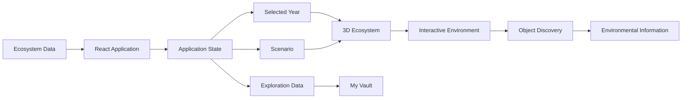
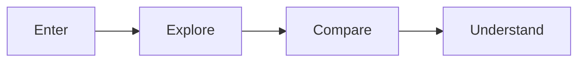
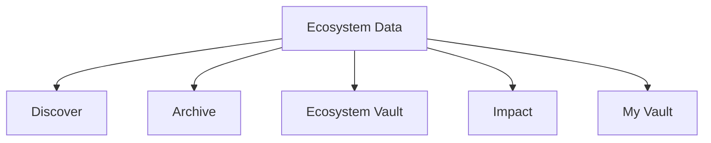

# 🌿 NatureVault

### Step inside nature. Travel through time. See what changes.

**NatureVault** is an interactive environmental time machine that lets users explore ecosystems in 3D, travel through different points in time, discover environmental features and species, and compare possible future scenarios.

Instead of only presenting environmental change through statistics, NatureVault lets users **experience the ecosystem itself**.

> **We don't want you to just read about what we're losing.
> We want you to step inside it.**

---

## 🌎 The Idea

Environmental change is often reduced to numbers and charts. While useful, these can be difficult to visualize or connect with.

NatureVault transforms environmental information into an **interactive place**.

### Past → Present → Future

Users can:

- 🌲 Explore different ecosystems
- 🕰️ Travel through time
- 🔍 Interact with environmental objects
- 🐦 Discover represented species
- 📊 View ecosystem health indicators
- 🔀 Compare possible future scenarios
- 🧠 Track their exploration in **My Vault**
- 📚 Browse an environmental archive

---

## ⚙️ How It Works

The core experience connects ecosystem data, application state, and a 3D environment.



The selected year acts as a central control. Changing it updates the represented ecosystem state, allowing users to observe how vegetation, water, biodiversity, habitat and other elements change over time.

---

## 🕰️ The Time Machine

The timeline allows users to move between historical conditions, the present, and possible future scenarios.

For example:

```
1980 → 1995 → 2010 → 2026 → 2050
```

As the selected year changes, the ecosystem representation responds accordingly.

> **Note:** Future scenarios are illustrative simulations and are not intended to be scientific forecasts.

---

## 🎮 User Journey

The experience is built around four simple actions:



---

## 🌲 Interactive 3D Ecosystems

The **3D Vault** is the core of NatureVault.

Users can enter an ecosystem and explore it directly rather than viewing it as a static image.

The environment can contain:

- 🌳 Vegetation
- 💧 Water systems
- 🐦 Wildlife
- 🪨 Terrain
- 🌿 Habitats
- 🏠 Human infrastructure
- 🌊 Environmental features

The 3D environment acts as both a visual simulation and an interactive learning interface.

---

## 🔍 Object Discovery

Environmental objects can be selected to reveal contextual information.

This allows users to move from:

**"What is this?"**

to

**"Why does this matter?"**

---

## 📊 Ecosystem Health

NatureVault provides an illustrative ecosystem-health interface based on several environmental dimensions.

These dimensions provide users with a simplified way to understand the overall condition of an ecosystem.

> **Note:** These indicators are educational simulation values, not scientific assessments.

---

## 🔀 Future Scenario Comparison

NatureVault allows users to compare possible future scenarios, such as:

**Continue As Is** vs **Protect & Restore**

The goal is not to predict exactly what will happen.

Instead, the simulation demonstrates:

> Different choices can lead to different possible futures.

---

## 🧠 My Vault

**My Vault** acts as the user's personal environmental memory.

Exploration can contribute to:

- Ecosystems explored
- Species discovered
- Observations
- Exploration history
- Environmental learning
- Actions learned

This turns NatureVault from a simple information website into a progressive exploration experience.

---

## 📚 Ecosystem Data Flow

The ecosystem data acts as the foundation for multiple parts of the application.



This allows different parts of the application to respond to the same underlying ecosystem information.

---

## 🧩 Application Structure

NatureVault follows a component-based React architecture.

```
App
│
├── Navigation
│
├── Landing
│
├── Discover
│   ├── Search
│   ├── Filters
│   └── Ecosystem Cards
│
├── Archive
│   └── Ecosystem Information
│
├── My Vault
│   ├── Exploration History
│   ├── Discovery Stats
│   └── Learning Progress
│
├── Impact
│   ├── Ecosystem Statistics
│   └── Suggested Actions
│
└── Ecosystem Vault
    ├── Time Machine
    ├── 3D Environment
    ├── Object Interaction
    ├── Information Panels
    ├── Biodiversity
    ├── Story Mode
    └── Scenario Comparison
```

---

## 🌐 Overall Architecture

```mermaid
flowchart TD
    App[App] --> Nav[Navigation]
    App --> Landing[Landing]
    App --> Discover[Discover]
    App --> Archive[Archive]
    App --> Vault[My Vault]
    App --> Impact[Impact]
    App --> EcoVault[Ecosystem Vault]

    Discover --> Search[Search]
    Discover --> Filters[Filters]
    Discover --> Cards[Ecosystem Cards]

    Archive --> ArchiveInfo[Ecosystem Information]

    Vault --> History[Exploration History]
    Vault --> Stats[Discovery Stats]
    Vault --> Progress[Learning Progress]

    Impact --> ImpactStats[Ecosystem Statistics]
    Impact --> Actions[Suggested Actions]

    EcoVault --> Time[Time Machine]
    EcoVault --> ThreeD[3D Environment]
    EcoVault --> Interaction[Object Interaction]
    EcoVault --> Panels[Information Panels]
    EcoVault --> Bio[Biodiversity]
    EcoVault --> Story[Story Mode]
    EcoVault --> Scenario[Scenario Comparison]
```



---

## 🤖 AI-Assisted Development

NatureVault was developed using an AI-assisted development workflow.

### Kiro IDE

Kiro IDE was used as the primary development environment for building and iterating on the project.

### Claude Sonnet 5

Claude Sonnet 5 was used throughout development as an AI development assistant.

AI assistance was used for:

- React and TypeScript implementation
- UI/UX development
- Component creation
- Interaction logic
- 3D environment development
- Debugging
- Feature iteration
- Code refinement
- Design experimentation

The generated implementations were continuously tested, modified and refined throughout development.

---

## 🛠️ Tech Stack

| Technology | Purpose |
|---|---|
| React | Frontend application |
| TypeScript | Type-safe development |
| Vite | Development and build tooling |
| HTML / CSS | UI structure and styling |
| 3D Rendering | Interactive ecosystem environments |
| Kiro IDE | Primary development environment |
| Claude Sonnet 5 | AI-assisted development |

---

## 🚀 Getting Started

### Prerequisites

- Node.js
- npm

### Installation

```bash
git clone <repository-url>
cd naturevault
npm install
```

### Start Development Server

```bash
npm run dev
```

Then open the local URL provided by Vite.

---

## ⚠️ Disclaimer

NatureVault is an educational interactive simulation.

The ecosystem health values, biodiversity indicators, species representations and future scenarios shown within the application are illustrative and should not be interpreted as scientific measurements, predictions or environmental assessments.

The goal is to make environmental change easier to:

**Visualize → Explore → Understand**

---

## 🌱 Vision

NatureVault asks:

> What if people could experience environmental change instead of simply reading about it?

By combining:

**3D Exploration + Time-Based Storytelling + Environmental Data + Interactive Discovery**

NatureVault turns environmental change from something people simply read about into something they can step inside.

---

### 🌿 NatureVault

*Step inside nature. Travel through time. See what changes.*
