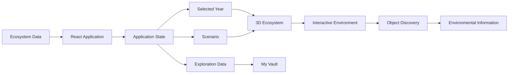
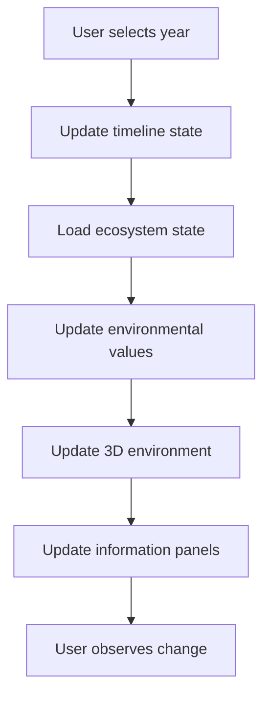
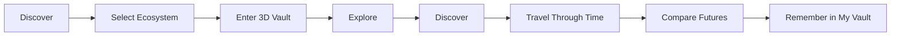

# 🌿 NatureVault

### Step inside nature. Travel through time. See what changes.

**NatureVault** is an interactive environmental time machine that lets users explore ecosystems in 3D, travel through different points in time, discover environmental features and species, and compare possible future scenarios.

Instead of only presenting environmental change through statistics, NatureVault lets users **experience the ecosystem itself**.

> **We don't want you to just read about what we're losing.
> We want you to step inside it.**

---

## 🌎 The Idea

Environmental change is often reduced to numbers and charts. While useful, these can be difficult to visualize or connect with.

NatureVault transforms environmental information into an **interactive place**.

### Past → Present → Future

Users can:

* 🌲 Explore different ecosystems
* 🕰️ Travel through time
* 🔍 Interact with environmental objects
* 🐦 Discover represented species
* 📊 View ecosystem health indicators
* 🔀 Compare possible future scenarios
* 🧠 Track their exploration in **My Vault**
* 📚 Browse an environmental archive

---

## ⚙️ How It Works

The core experience connects ecosystem data, application state, and a 3D environment.



The selected year acts as a central control. Changing it updates the represented ecosystem state, allowing users to observe how vegetation, water, biodiversity, habitat and other elements change over time.

---

## 🕰️ The Time Machine

The timeline allows users to move between historical conditions, the present, and possible future scenarios.



For example:

**1980 → 1995 → 2010 → 2026 → 2050**

The future scenarios are **illustrative simulations, not scientific forecasts**.

---

## 🎮 User Journey



The experience is built around four simple actions:

**Enter → Explore → Compare → Understand**

---

# 📸 Experience

### Landing

The landing experience introduces NatureVault as an interactive time machine for ecosystems.


### Explore Ecosystems

Users can browse and filter ecosystems before entering their individual Vaults.


### Environmental Archive

The archive preserves ecosystem snapshots and highlights how environments change over time.


### My Vault

Exploration history, discovered species, observations and learning progress are collected in the user's personal Vault.


### 3D Ecosystem Vault

The core experience is an explorable 3D ecosystem where users can move around and interact with the environment.


### Interactive Discovery

Clicking objects reveals contextual information about what they are, why they matter, their habitat, changes over time, environmental pressures and related species.


### Ecosystem Health

The application provides an illustrative overview of biodiversity, habitat, water, vegetation and human pressure.


---

## 🌱 Future Scenarios

NatureVault allows users to compare possible outcomes such as:

**Continue As Is** vs **Protect & Restore**

The goal isn't to predict exactly what will happen.

Instead, the simulation demonstrates a simple idea:

> **Different choices can lead to different possible futures.**

---

## 🛠️ Tech Stack

| Technology          | Purpose                            |
| ------------------- | ---------------------------------- |
| **React**           | Frontend application               |
| **TypeScript**      | Type-safe development              |
| **Vite**            | Development & build tooling        |
| **CSS / HTML**      | UI and visual design               |
| **3D Rendering**    | Interactive ecosystem environments |
| **Kiro IDE**        | Primary development environment    |
| **Claude Sonnet 5** | AI-assisted development            |

---

## 🤖 AI-Assisted Development

NatureVault was developed using an **AI-assisted development workflow**.

**Kiro IDE** was used as the primary development environment, while **Claude Sonnet 5** was used throughout development to assist with:

* React & TypeScript implementation
* UI/UX development
* Component creation
* Interaction logic
* 3D environment development
* Debugging
* Feature iteration
* Code refinement

The generated implementations were continuously tested, modified and refined during development.

---

## 🚀 Run Locally

### Prerequisites

* Node.js
* npm

### Installation

```bash
git clone <repository-url>
cd naturevault
npm install
```

### Start Development Server

```bash
npm run dev
```

Then open the local URL provided by Vite.

---

## ⚠️ Disclaimer

NatureVault is an **educational interactive simulation**.

The ecosystem health values, biodiversity indicators, species representations and future scenarios are illustrative and should **not** be interpreted as scientific measurements, predictions or environmental assessments.

The goal is to make environmental change easier to **visualize, explore and understand**.

---

## 🌿 Vision

NatureVault asks:

> **What if people could experience environmental change instead of simply reading about it?**

By combining **3D exploration, time-based storytelling, environmental data and interactive discovery**, NatureVault turns environmental change from something people simply read about into something they can **step inside**.

### **NatureVault — Step inside nature.**
